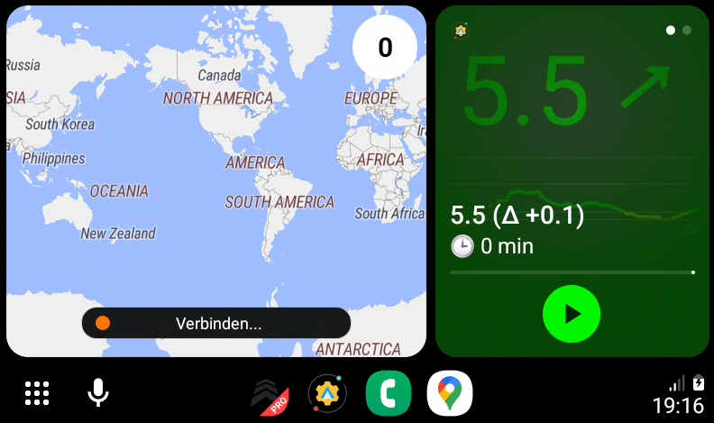
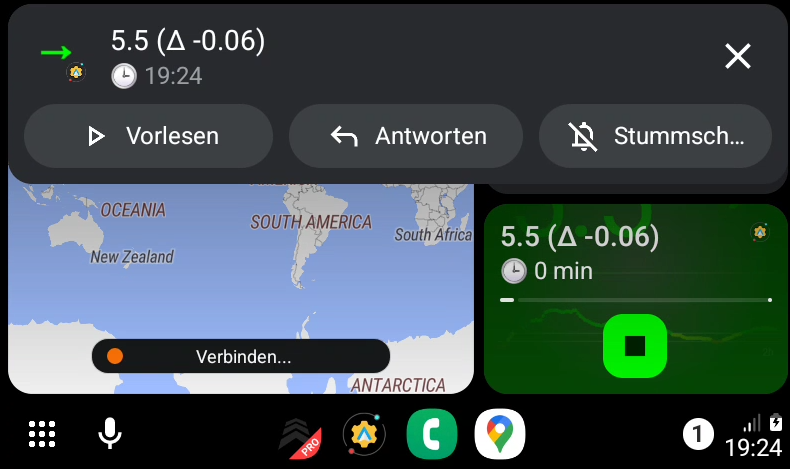
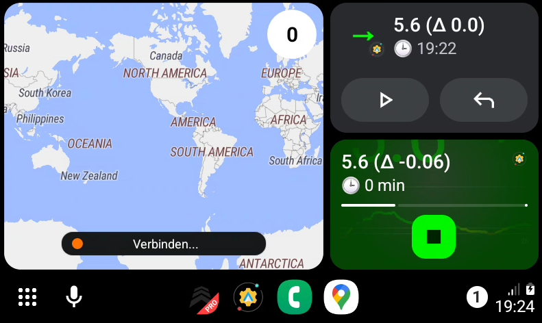
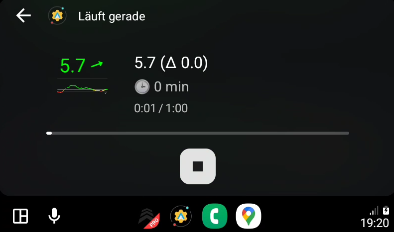

[ Deutsche Version](GlucoDataAuto_DE.md)  
[ Wersja polska](GlucoDataAuto_PL.md)

# Android Auto

As the Android Auto part of GlucoDataHandler does not fullfill Google PlayStore policies, this part has been moved to an extra app called GlucoDataAuto, which receives its settings and values from GlucoDataHandler. 

It can also be used as standalone application for Juggluco or xDrip+.

Install last GlucoDataAuto_X.X.X.apk from [Releases](https://github.com/pachi81/GlucoDataHandler/releases) 

## Option #1: Using dummy media player
If you are not using any Android Auto media player for listen music, you can use GlucoDataHandler to display its values in the media tap:

IMPORTANT: it is recommended to disable all other media apps in the Android Auto launcher, to get this to work.

## Option #2: Using notifications

You can also use notifications:

 

## Option #3: Using the app

# Setup Android Auto

To activate GlucoDataHandler for Android Auto, you have to do the following steps:

## 1. Activate developer mode

* open Android Auto app
* scroll down to the Version
* tap several times on the Version until a popup appears to "Allow development settings"
* press "OK"

## 2. Activate "Unknwon sources"

* open Android Auto app
* open in the 3-dot menu the "Developer settings"
* scroll down to "Unknown source"
* enable it

## 3. Set Notifications settings

* open Android Auto app
* scroll down to "Notifications"
* enable "Show conversations"
* enable "Show first line of conversations"
