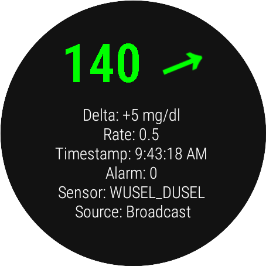

[ Deutsche Version](INSTALLATION_DE.md)  
[ Wersja polska](INSTALLATION_PL.md)

# Install

## Prerequisite
Juggluco or xDrip+ is installed on your phone or wear and connected to your sensor.

## 1 - Install GlucoDataHandler on your phone

On your phone go the the [Releases](https://github.com/pachi81/GlucoDataHandler/releases) page and select the last (top) pre-release or release.  
Download and install `GlucoDataHandler.apk` (allow install from unknown source if required).


### Configure Juggluco
If you are using Juggluco to receive glucose values, open Juggluco and enable `Glucodata broadcast` and select `de.michelinside.glucodatahandler` in Settings. Save and Ok.


### Configure xDrip+
If you are using xDrip+ to receive glucose values, open xDrip+, go to setting and select Inter-app settings
* Enable "Broadcast locally"
* Enable "Compatible Broadcast"
* Check "Identify receiver" to be empty or if there is already an entry, add a new line with `de.michelinside.glucodatahandler`
  


### Check mobile app
Open the app and wait for a glucose value to be displayed in the GlucoDataHandler app.


## 2 - Install GlucoDataHandler on your watch

Now download `GlucoDataHandler-Wear.apk` on your phone but **do not install it**.


### Method #1 - Install with Wear Installer 2

Follow the instructions in [this video](https://www.youtube.com/watch?v=ejrmH-JEeE0) to install `GlucoDataHandler-Wear.apk` on your watch.

### Method #2 - Install with Wear Installer

Follow the instructions in [this video](https://www.youtube.com/watch?v=8HsfWPTFGQI) to install `GlucoDataHandler-Wear.apk` on your watch.

### Method #3 - Install with Android Debug

Download `GlucoDataHandler-Wear.apk` on your computer,install ADB, enable developer mode on the watch (see the videos above), once connected type this command in ADB, from the folder where you downloaded the wear extension file.

```
adb install -r -g GlucoDataHandler-Wear.apk
```

### Wear OS 4

With Wear OS 4, you have to pair you phone/computer first with your watch. In Wear Installer 2 there is an [introduction video](https://youtu.be/abgN4jQqHb0) for. 

For computer, the handling is similar:

* activate ADB Debugging on your watch
* activate Wireless Debugging on your watch
* press Pair new device on your watch
* on computer type: 
```adb pair [ip]:[port] [pairing-code]```
* after pairing is done, you have to use ip and port (not from pairing) to connect to your watch: 
```adb connect [ip]:[port]```

The pairing has to be done only once for each device. After a device is paired, you only have to connect with ip AND(!) port to the device the next time.

### More information

See [here](https://forum.xda-developers.com/t/how-to-install-apps-on-wear-os-all-methods.4510255/) for more information.

### Check installation

You should now have the GlucoDataHandler app on your watch.


Open the app and make sure "Foreground" is activated (recommended).



## 3 - Setup a complication

Select a watchface that supports a complication, you will recognize it by the cog below.


Select a field.


Select the GlucoDataHandler app, then the information type.


You can customize other fields with different information.

And you should be set.


## 4 - Setup Android Auto

To activate GlucoDataHandler for Android Auto, you have to do the following steps:

### 1. Activate developer mode

* open Android Auto app
* scroll down to the Version
* tap several times on the Version until a popup appears to "Allow development settings"
* press "OK"

### 2. Activate "Unknwon sources"

* open Android Auto app
* open in the 3-dot menu the "Developer settings"
* scroll down to "Unknown source"
* enable it

### 3. Set Notifications settings

* open Android Auto app
* scroll down to "Notifications"
* enable "Show conversations"
* enable "Show first line of conversations"
