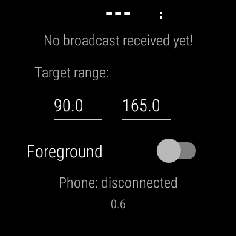

# Install

This is a basic install: Juggluco is installed on your phone, connected to your sensor and your smartwatch will display the values when connected to the phone.

## Prerequisite

Your smartwatch must be paired with the smartphone you will use to setup GlucoDataHandler.

## 1 - Install GlucoDataHandler on your phone

On your phone go the the [Releases](https://github.com/pachi81/GlucoDataHandler/releases) page and select the last (top) pre-release or release.  
Download and install `GlucoDataHandler.apk` (allow install from unknown source if required).


Open Juggluco and enable `Glucodata broadcast` and select `de.michelinside.glucodatahandler` in Settings. Save and Ok.


Open the app, you should now also see your BG display in the GlucoDataHandler app.


## 2 - Install GlucoDataHandler on your watch

Now download `GlucoDataHandler-Wear.apk` on your phone but **do not install it**.


### Method #1 - Install with Wear Installer 2

Follow the instructions in [this video](https://www.youtube.com/watch?v=ejrmH-JEeE0) to install `GlucoDataHandler-Wear.apk` on your watch.

### Method #2 - Install with Wear Installer

Follow the instructions in [this video](https://www.youtube.com/watch?v=8HsfWPTFGQI) to install `GlucoDataHandler-Wear.apk` on your watch.

### Method #3 - Install with Android Debug

Download `GlucoDataHandler-Wear.apk` on your computer,install ADB, enable developer mode on the watch (see the videos above), once connected type this command in ADB, from the folder where you downloaded the wear extension file.

```
adb install -r GlucoDataHandler-Wear.apk
```

### Other methods

See [here](https://forum.xda-developers.com/t/how-to-install-apps-on-wear-os-all-methods.4510255/).

You should now have the GlucoDataHandler app on your watch.


Open it and setup the range.



## 3 - Setup a complication

Select a watchface that supports a complication, you will recognize it by the cog below.


Select a field.


Select the GlucoDataHandler app, then the information type.


You can customize other fields with different information.

And you should be set.

