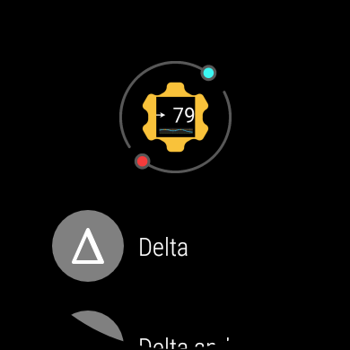

[ English version](INSTALLATION.md)  
[ Wersja polska](INSTALLATION_PL.md)

# Installation

## Voraussetzung

Juggluco oder xDrip+ ist auf dem Smartphone oder auf der Smartwatch installiert und empfängt Daten von einem Sensor.

## 1 - Installation GlucoDataHandler auf dem Smartphone

Lade die letzte Version von `GlucoDataHandler.apk` von [hier](https://github.com/pachi81/GlucoDataHandler/releases) auf das Smartphone herunter und installiere sie
(dafür muss die Installation von unbekannten Quellen erlaubt werden).


## 2 - Installation GlucoDataHandler auf dem Smartwatch

Die Datei `GlucoDataHandler-Wear.apk` auf das Telefon laden, aber **nicht installieren.**.


### Entwicklermodus auf der Smartwatch aktivieren

Für die Installation auf der Smartwatch gibt es mehrere Möglichkeiten, in allen Fällen müssen aber die Entwicklereinstellungen aktiviert sein:

1. Einstellungen -> Info zur Uhr -> Softwareversion
2. So lange drauf klicken bis "Entwicklermodus aktiviert" kommt.
3. Danach in den Einstellungen ganz unten in den Entwickleroptionen -> ADB Debugging aktivieren
4. Über WLAN debuggen zulassen (Uhr muss dazu im gleichen WLAN wie das Handy sein)
5. Wireless debugging aktivieren. Da seht ihr dann auch die IP Adresse eurer Uhr - die notieren, braucht ihr später noch!


### Method #1 - Installation mit Wear Installer 2 (empfohlen)
1. Im "Wear Installer 2" die IP Adresse der Uhr eingeben und dann unter "Custom APK" zum Downloadort der GlucoHandler Wear-App navigieren.
2. Die App auf der Uhr installieren. Wenn das abgeschlossen ist (kann 2, 3 Minuten dauern) kann das ADB-Debugging auf der Uhr wieder abgeschalten werden.
3. Auf der Uhr die GlucoDataHandler App öffnen, "Vordergrund" aktivieren und prüfen ob die Werte auch ankommen.

Eine Anleitung gibt es auch in diesem [Video (en)](https://www.youtube.com/watch?v=ejrmH-JEeE0).

### Method #2 - Installation mit ADB

Die Datei `GlucoDataHandler-Wear.apk` auf dem Computer herunterladen und mit dem Befehl installieren: 

```
adb install -r -g GlucoDataHandler-Wear.apk
```

Eine genauere Anleitung gibt es [hier](https://www.a7la-home.com/de/how-to-install-apks-on-wear-os-smartwatches).

### Wear OS 4
Mit Wear OS 4 muss man die Uhr erst mit dem Telefon oder dem Computer verbinden.

Für Wear Installer 2 gibt es dafür ein [Video](https://youtu.be/abgN4jQqHb0).

Auf dem Computer is es ähnlich:

* ADB Debugging auf der Uhr aktivieren
* Wireless Debugging auf der Uhr aktivieren
* Auf der Uhr Neues Gerät koppeln drücken
* Mit den Daten aus diesem Dialog auf dem Computer folgendes eingeben:
```
adb pair [ip]:[port] [pairing-code]
```

Das Koppeln ist pro Gerät nur einmal erforderlich. Danach muss man sich nur mit der Uhr verbinden. Es ist dabei aber wichtig, dass man nun auch den Port (nicht aus dem Koppeldialog) mit angibt:

```
adb connect [ip]:[port]
```

### Mehr Informationen

Eine genauere Anleitung der Installationsmöglichkeiten gibt es [hier](https://forum.xda-developers.com/t/how-to-install-apps-on-wear-os-all-methods.4510255/), allerdings in Englisch.

### Installation prüfen

Die App auf der Smartwatch öffnen und nachdem sie die Werte entweder von Juggluco oder GlucoDataHandler auf dem Smartphone empfangen hat, sie es dann so aus:


## 3 - Complications auf der Smartwatch verwenden

Ein Watchface auswählen, welche Complications unterstützt und lange draufdrücken, bis es so aussieht:


Die Einstellungen öffnen und ein Feld auswählen:


Dann GlucoDataHandler auswählen und eine Complication nach Wahl verwenden:



Das für anderen Complications entsprechend wiederholen. Danach müssten die Werte im Watchface sichtbar sein:


