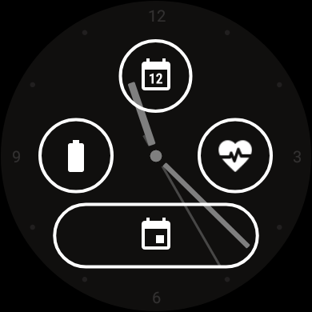

[ English version](INSTALLATION.md)  
[ Deutsche Version](INSTALLATION_DE.md)

# Instalacja

## Warunek wstępny

Aplikacja Juggluco lub xDrip+ jest zainstalowana na telefonie lub zegarku i łączy z sensorem.

## 1 – Zainstaluj GlucoDataHandler na swoim telefonie

W telefonie przejdź do strony [Releases](https://github.com/pachi81/GlucoDataHandler/releases) i wybierz ostatnią (górną) wersję przedpremierową lub wersję stabilną.
Pobierz i zainstaluj `GlucoDataHandler.apk` (w razie potrzeby zezwól na instalację z nieznanego źródła).


### Konfiguracja Juggluco

Jeśli używasz Juggluco do odbierania wartości glukozy, otwórz Juggluco i włącz w Ustawieniach opcję `Glucodata broadcast` i wybierz `de.michelinside.glucodatahandler`. Zapisz i OK.


### Konfiguracja xDrip+

Jeśli używasz xDrip+ do odbierania wartości glukozy, otwórz xDrip+, przejdź do ustawień i wybierz Ustawienia innych aplikacji

- Włącz opcję „Nadawaj lokalnie"
- Włącz opcję „Kompatybilny Broadcast"
- Sprawdź czy opcja „Identyfikuj odbiornik" jest pusta


### Sprawdź aplikację na telefonie

Otwórz aplikację i poczekaj na wyświetlenie wartości glukozy w aplikacji GlucoDataHandler.


## 2 – Zainstaluj GlucoDataHandler na swoim zegarku

Pobierz teraz aplikację `GlucoDataHandler-Wear.apk` na swój telefon, ale nie instaluj jej.


### Metoda nr 1 – Instalacja za pomocą Wear Installer 2

Postępuj zgodnie z instrukcjami [tym filmie](https://www.youtube.com/watch?v=ejrmH-JEeE0), aby zainstalować `GlucoDataHandler-Wear.apk` na swoim zegarku.

### Metoda nr 2 – Instalacja za pomocą Wear Installer

Postępuj zgodnie z instrukcjami [tym filmie](https://www.youtube.com/watch?v=8HsfWPTFGQI), aby zainstalować `GlucoDataHandler-Wear.apk` na swoim zegarku.

### Metoda nr 3 – Instalacja za pomocą Android Debug

Pobierz `GlucoDataHandler-Wear.apk` na swój komputer, zainstaluj ADB, włącz tryb programisty na zegarku (zobacz filmy powyżej), po podłączeniu wpisz poniższe polecenie w ADB, będąc w folderze, do którego pobrałeś plik aplikacji na zegarek.

```
adb install -r GlucoDataHandler-Wear.apk
```

### Więcej informacji

[Tutaj](https://forum.xda-developers.com/t/how-to-install-apps-on-wear-os-all-methods.4510255/) można przeczytać więcej informacji.

### Sprawdź instalację

Teraz na zegarku powinna znajdować się aplikacja GlucoDataHandler.


Otwórz aplikację i upewnij się, że opcja „Pierwszy plan" jest włączona (zalecane).


## 3 – Konfiguracja komplikacji

Wybierz tarczę zegarka, która obsługuje komplikacje; rozpoznasz ją po zębatce widocznej poniżej podglądu tarczy.


Wybierz pole.



Wybierz aplikację GlucoDataHandler, a następnie typ informacji.


Inne pola można dostosować za pomocą różnych informacji.

I powinieneś być gotowy.


## 4 – Konfiguracja Android Auto

Aby aktywować GlucoDataHandler dla Android Auto, należy wykonać następujące kroki:

### 1. Aktywacja trybu programisty

- otwórz aplikację Android Auto
- przewiń w dół do pozycji Wersja
- dotknij kilkakrotnie pozycji Wersja, aż pojawi się wyskakujące okienko „Zezwalaj na ustawienia programistyczne"
- naciśnij "OK"

### 2. Aktywuj „Nieznane źródła"

- otwórz aplikację Android Auto
- otwórz w menu (3 kropki) „Ustawienia programisty"
- przewiń w dół do pozycji „Nieznane źródło"
- włącz ją

### 3. Ustawienia powiadomień

- otwórz aplikację Android Auto
- przewiń w dół do pozycji „Powiadomienia"
- włącz „Pokazuj rozmowy"
- włącz „Pokazuj pierwszy wiersz rozmów"