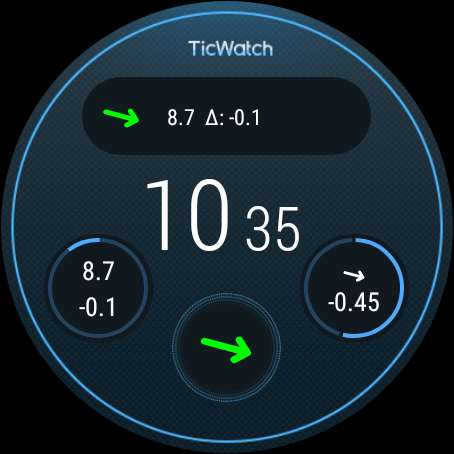

# Glucose Data Handler

This Android and Wear OS App receives glucodata broadcasts from Juggluco (mobile or/and wear version).
The mobile version provides a tasker event plugin to handle these data in tasker.
The wear version provides some complication, which can be used in every watchface with complication support.

The wear version is a standalone version, you don´t need the mobile version, if you don´t have problems with the communication between the mobile and wear version of Juggluco. If you have any troubles or you can not install Juggluco on your mobile device for any reason, you can use my both apps which are also exchanging the glucodata broadcast.

## Installation
### Mobile
Install the last released version and start it once. 
You will be asked to disable battery optimization. Please turn it off.

### Wear
A guide to install an apk on wear can be found [here](https://forum.xda-developers.com/t/how-to-install-apps-on-wear-os-all-methods.4510255/).

## Configuration
In Juggluco activate "Glucodata broadcast" in the settings menu.

### Wear

#### Settings

* Target range: set your target glucose range needed for yellow color of the rate image (red color is set for an alarm)
* Foreground: only if you have trouble with updating complications (also try deactivating Play Protect as this kills non Playstore apps)

#### Complications
There are several complications for the different types of wear OS complications, which provides:
* Glucose value (used also for range circle)
* Delta value (per minute)
* Rate (trend) as value, arrow and range (For range the watchface must support negative values! You can try if with the test complication.)

**IMPORTANT:** Not all complications are fully supported by any watchface. For example the SHORT_TEXT type supports an icon, a text and a title, but the most watchfaces only show icon and text or text and title, but there are some, showing all 3 types in one.
Also the RANGE_VALUE complication is handled different in each watchface. Some watchfaces supports negative values for the range circle. To test, if your watchface supports negative range values, you can use my *Test range complication ...* complication to verify it.

### Tasker Variables

The event contains these variables:

| Tasker Variable | glucodata.Minute Variable | Description                                                                            |
| ----------------- | --------------------------- | ---------------------------------------------------------------------------------------- |
| %alarm          | Alarm                     | Alarm value set by Juggluco (0: no value, 6: high glucose value, 7: low glucose value) |
| %arrow          | -                         | Calculate unicode arrow for the current rate value                                     |
| %delta          | -                         | Delta per minute between the current and the last value (mg/dl or mmol/l)              |
| %dexcomlabel    | -                         | Calculated dexcom specific label for the current rate value                            |
| %glucose        | glucose                   | Glucose value in the unit, defined in Juggluco app (mg/dl or mmol/l)                   |
| %rate           | Rate                      | Rate of change of the glucose value                                                    |
| %ratelabel      | -                         | Calculated label for the current rate value                                            |
| %rawvalue       | mgdl                      | Glucose value in mg/dl                                                                 |
| %sensorid       | SerialNumber              | Serial number of the current used sensor                                               |
| %time           | Time                      | Timestamp in ms since 1.1.1970                                                         |
| %timediff       | -                         | Duration in ms between the current and the previous received value                     |
| %unit           | -                         | Unit of the glucose value, either mg/dl or mmol/l                                      |
