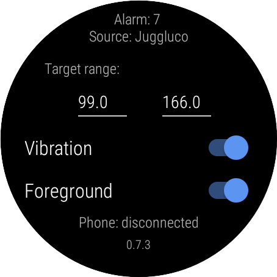
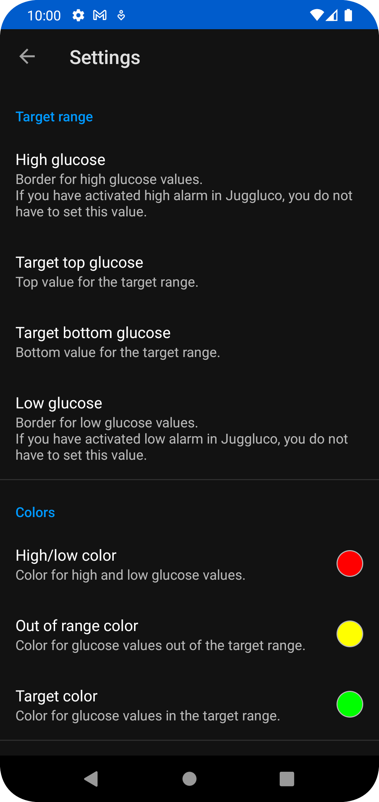
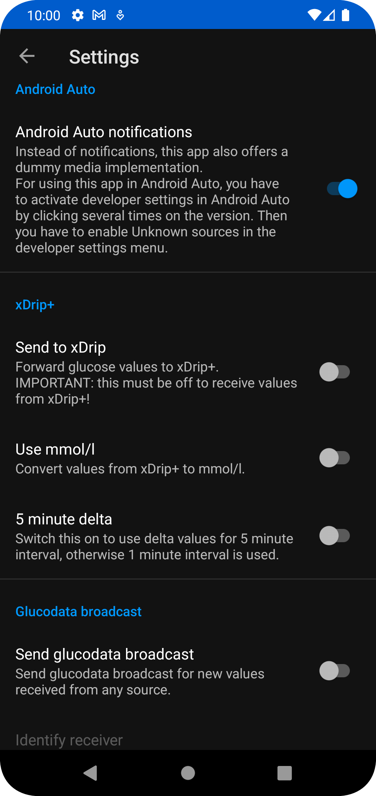

[Deutsche Version](README_DE.md)

# Glucose Data Handler
## Features

* receives glucose values from Juggluco
* receives glucose values from xDrip+
* provide several **[complications](#complications)** for Wear OS
* provide **[Android Auto](#android-auto)** support
* provide **[Tasker event](#tasker)** for new glucose values
* send glucodata broadcasts to other apps (which supports this broadcast)

## Download
You can download the current version [here](https://github.com/pachi81/GlucoDataHandler/releases).

## Installation

-> [Installation instruction](./INSTALLATION.md)

## Settings

### Wear

* Vibration: the watch vibrate if the target range is left and repeat it as long as the target range is left
* Foreground: recommended to prevent Wear OS from closing this app (also try deactivating Play Protect as this kills non Playstore apps)
* other settings: all other settings are made in the phone app

### Phone

The settings for the phone are described in the app itself. The settings from the phone will be send to the wear, if it is connected.

 

#### Complications
There are several complications for the different types of wear OS complications, which provides:
* Glucose value (used also for range circle)

 

* Glucose value as background image (if supported by watch face and it seems to be only available in Wear OS 3)

 

* Delta value (per minute or per 5 minutes)

* Rate (trend) as value and arrow (the arrow rotate dynamically between +2.0 (↑) and -2.0 (↓) and shows double arrows from +3.0 (⇈) and from -3.0 (⇊))

* Battery level from wear and phone (if connected)

**IMPORTANT:** Not all complications are fully supported by any watchface. For example the SHORT_TEXT type supports an icon, a text and a title, but the most watchfaces only show icon and text or text and title, but there are some, showing all 3 types in one.
Also the RANGE_VALUE complication is handled different in each watchface.

### Android Auto

This app supports Android Auto.

#### Option #1: Using dummy media player
If you are not using any Android Auto media player for listen music, you can use GlucoDataHandler to display its values in the media tap:

IMPORTANT: it is recommended to disable all other media apps in the Android Auto launcher, to get this to work.

#### Option #2: Using notifications

You can also use notifications:

 

#### Option #3: Using the app

### Tasker

-> [Tasker support](./TASKER.md)

