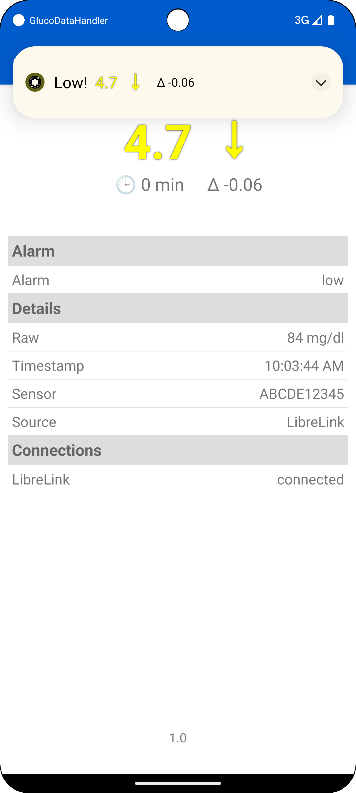
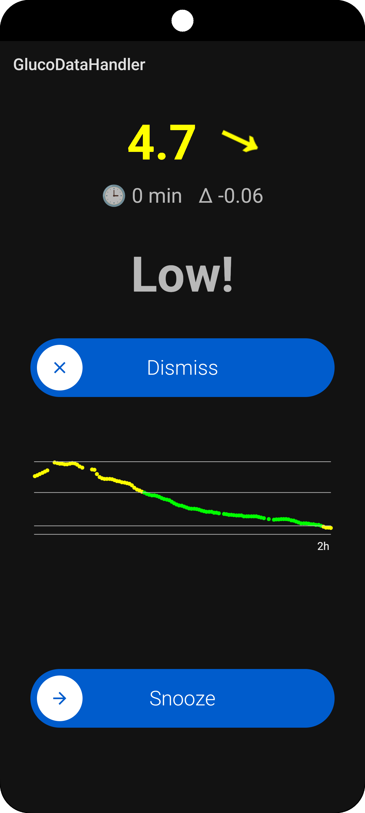
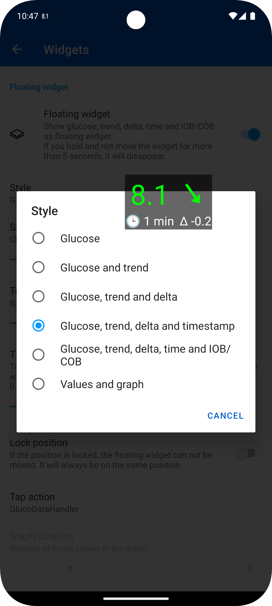
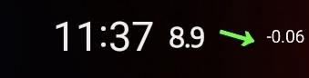
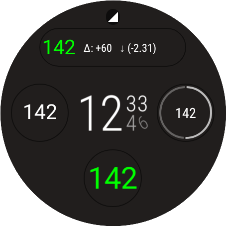
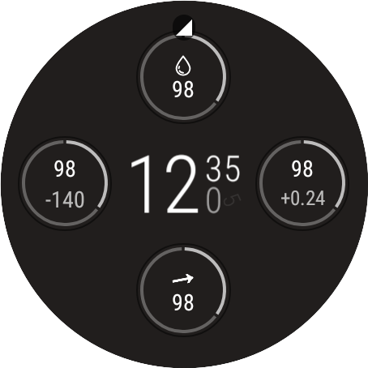
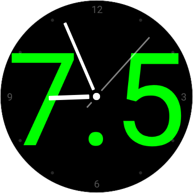
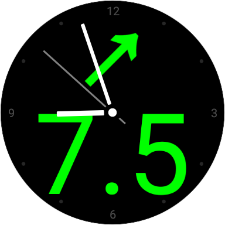
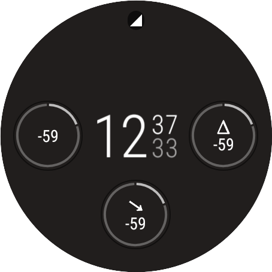
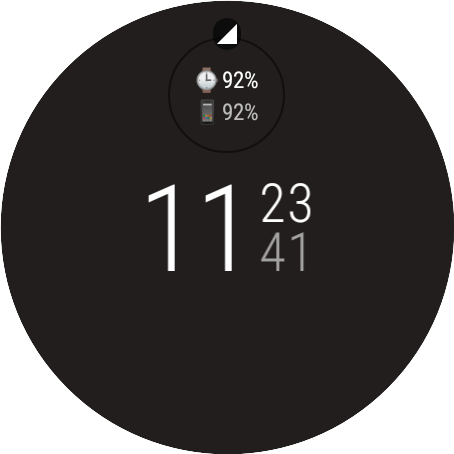

[ Deutsche Version](README_DE.md)  
[ Wersja polska](README_PL.md)

# GlucoDataHandler (GDH)

Your central hub for glucose readings on your Android devices!

Keep Your Glucose Levels in Check with GlucoDataHandler!

This innovative app receives data from various sources and visualizes it clearly on your Android smartphone, smartwatch (Wear OS, Miband, and Amazfit), and in your car (via GlucoDataAuto).

## Features

* **Diverse Data Sources:**
    * **Cloud Services:**
        * Receives glucose values as **[LibreLink follower](./SOURCES.md#librelink)**
        * Receives glucose values as **[Dexcom Share follower](./SOURCES.md#dexcom-share)**
        * Receives glucose, IOB and COB values from **Nightscout** (pebble interface)
    * **Local Apps:**
        * Receives glucose, IOB and COB values from **[AndroidAPS](./SOURCES.md#androidaps)**
        * Receives glucose values from **[Juggluco](./SOURCES.md#juggluco)**
        * Receives glucose values from **[xDrip+](./SOURCES.md#xdrip)**
        * Receives glucose values from **[Eversense](./SOURCES.md#eversense)** (using **[ESEL](https://github.com/BernhardRo/Esel)**)
        * Receives glucose values from **[Dexcom BYODA](./SOURCES.md#dexcom-byoda)** (not tested, yet!)
    * **Notifications (Beta!):** Receives values from Cam APS FX, Dexcom G6/G7, Eversense, and potentially many more apps (just contact me!).

* **Comprehensive Visualization:**
    * Provides several **[widgets](#widgets)** and a floating widget for the phone.
    * Provides optional **[notifications](#notifications)** with different icons for the phone.
    * Optional display as lock screen wallpaper.
    * Always On Display (AOD) support.

* **Customizable Alarms:**
    * Support for **[alarms](#alarms)**:
        * Alarm for very low, low, high, very high and obsolete glucose values.
        * Individual sound settings for each alarm type.
        * Fullscreen alarm on lockscreen.

* **Wear OS Integration:**
    * Provides several **[complications](#complications)** for Wear OS.
    * Receive alarms directly on your watch.
    * **IMPORTANT NOTE:** GDH is not a standalone Wear OS app. The phone app is required for setup.

* **WatchDrip+ Support:** Use GDH with specific Miband and Amazfit devices.

* **Accessibility:** Full TalkBack support (Thanks to Alex for testing!).

* **Android Auto:** **[Android Auto](https://github.com/pachi81/GlucoDataAuto/blob/main/README.md)** support using [GlucoDataAuto app](https://github.com/pachi81/GlucoDataAuto/releases)

* **Tasker Integration:** **[Tasker](#tasker)** integration

* **Data Forwarding:** Sends glucodata broadcasts to other apps (which supports this broadcast).

## Download
 

You can download the current version [here](https://github.com/pachi81/GlucoDataHandler/releases).

## Installation

-> [Manual installation instruction](./INSTALLATION.md)

## Sources

-> [Source configuration instruction](./SOURCES.md)

## Settings

### Wear

* Vibration: the watch vibrate if the target range is left and repeat it as long as the target range is left
* Colored AOD: some watchfaces only support colored complications for the always on display, if there is no monochrom one, then you have to activate this feature
* Big trend-arrow: for watches like Samsung Galaxy Watch 5 Pro until Wear OS 3, the trend arrow is rendered too big, so you can disable this setting to have a smaller trend-arrow
* Foreground: recommended to prevent Wear OS from closing this app (also try deactivating Play Protect as this kills non Playstore apps)
* Relative time: shows the relative time in minutes since the last value was received instead of the timestamp of the last value. This may not work correct on some watches related to Android battery optimizations.
* other settings: all other settings are made in the phone app

### Phone

The settings for the phone are described in the app itself. The settings from the phone will be send to the wear, if it is connected.

## Alarms

Individual alarm configuration for the different types, which can be displayed as a notification or as full screen on the lock screen:

  

## Widgets
There are several types of widgets and a floating widget for the phone:

  

## Notifications
There are two notifciations which can be activated. For each notification the icon can be choosen, which will appear in the status bar of your phone.
The first notification is also be used as foreground notification to prevent Android to close this app in the background. 
So if you have any trouble with this app, I recommend to activate at least the first notification.
The second notification is an empty notification, which you can activate to have an additional icon in the status bar.
<figure>
   
  <figcaption>Status bar shows the usage of the trend-arrow and the delta value icons next to the glucose value icon from Juggluco.</figcaption>
</figure>

## Complications
There are several complications for the different types of wear OS complications, which provides:
* Glucose value (used also for range circle)

 

* Glucose value as background image (if supported by watch face and it seems to be only available in Wear OS 3)

 

* Delta value (per minute or per 5 minutes)

* Rate (trend) as value and arrow (the arrow rotate dynamically between +2.0 (↑) and -2.0 (↓) and shows double arrows from +3.0 (⇈) and from -3.0 (⇊))

* Battery level from wear and phone (if connected)

**IMPORTANT:** Not all complications are fully supported by any watchface. For example the SHORT_TEXT type supports an icon, a text and a title, but the most watchfaces only show icon and text or text and title, but there are some, showing all 3 types in one.
Also the RANGE_VALUE complication is handled different in each watchface.

## Tasker

-> [Tasker support](./TASKER.md)

# Special thanks
@[lostboy86](https://github.com/lostboy86) for testing, motivation and feedback

@[froter82](https://github.com/froster82) for Polish translation, testing and feedback

@[nevergiveup](https://github.com/nevergiveup) for testing, motivation and feedback

# Support my work
[🍺 Buy me a beer](https://www.buymeacoffee.com/pachi81)

[Paypal me](https://paypal.me/pachi81)
