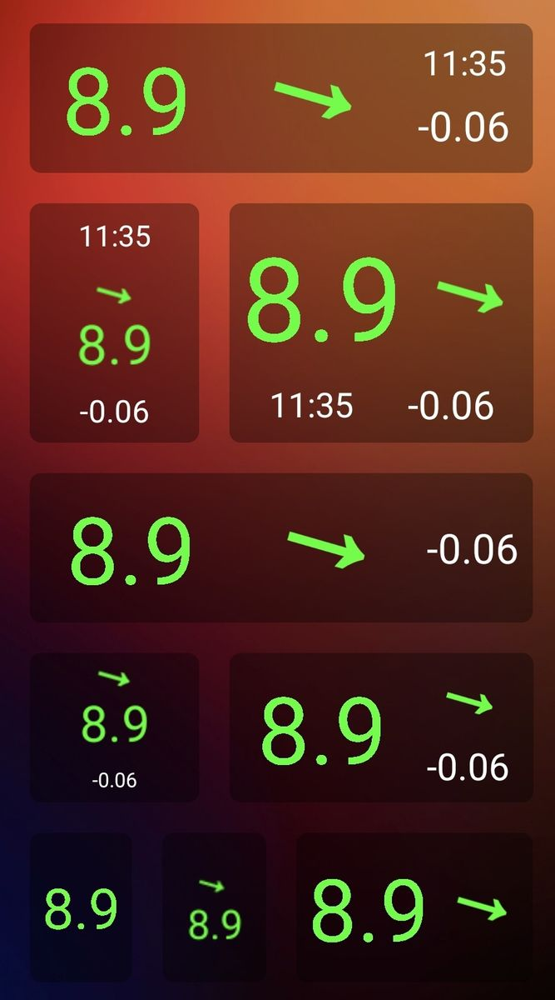
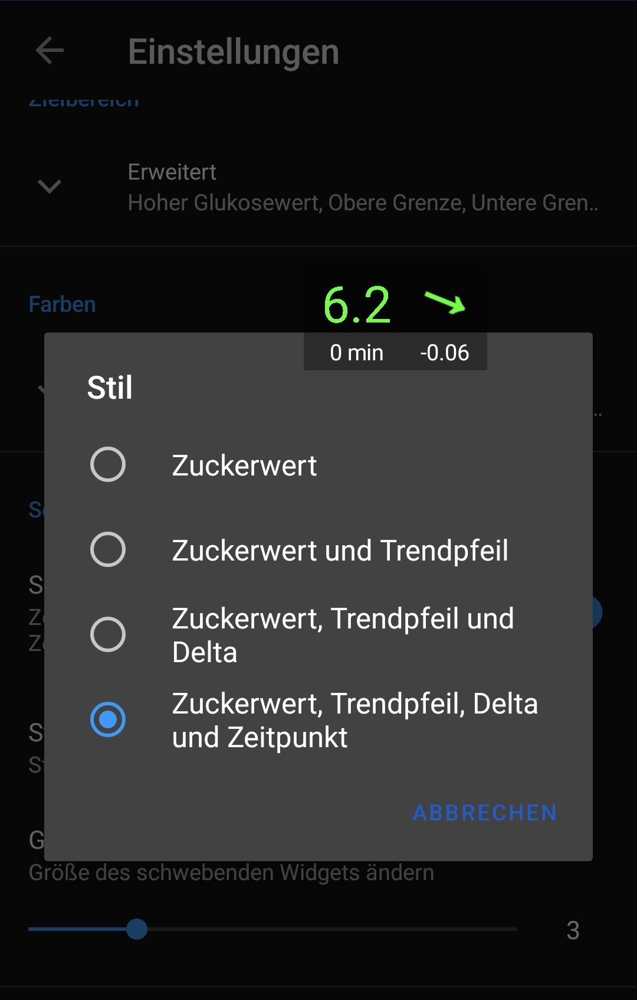

[ English version](README.md)  
[ Wersja polska](README_PL.md)

# Glucose Data Handler
## Features

* empfängt Glukose Werte von Juggluco
* empfängt Glukose Werte von xDrip+
* stellt mehrere **[Widgets](#widgets)** für Android zur Verfügung
* optionale **[Benachrichtigungen](#benachrichtigungen)** um weitere Statusbar-Icons zur Verfügung zu haben
* stellt mehrere **[Complications](#complications)** für Wear OS zur Verfügung
* unterstützt **[Android Auto](#android-auto)**
* **[Tasker Ereignisse](#tasker)** Integration
* sendet Glucodata Broadcasts an andere Apps (die dies unterstützen)

## Download
Die neuste Version kann [hier](https://github.com/pachi81/GlucoDataHandler/releases) heruntergeladen werden.

## Installation

-> [Installationsanleitung](./INSTALLATION_DE.md)

## Einstellungen

### Smartwatch

* Vibrieren: die Uhr vibriert, wenn der Zielbereich verlassen wird in regelmäßigen Intervallen
* Farbiges AOD: Manche Watchfaces zeigen im Ambient-Mode (AOD) auch farbige Complications (Bilder) an, aber nur, wenn kein monochromes Bild vorhanden ist 
-> dies kann man mit dieser Einstellung erzwingen, dann wird kein monochromes Bild für den Ambient Mode zur Verfügung gestellt. Wenn dann im Ambient-Mode nichts zu sehen ist, muss man die Einstellung rückgängig machen
* Großer Trendpfeil: auf manchen Uhren, wie die Samsung Galaxy Watch 5 Pro mit Wear OS 3, wird der farbige Trendpfeil zu groß erzeugt. Damit man einen normalen Trendpfeil sieht, muss man auf diesen Uhren diese Einstellung deaktivieren
* Vordergrund: um zu verhindern, dass Wear OS die App beendet, empfehle ich diese Einstellung zu aktivieren
* Relative Zeit: zeigt die Zeit in Minuten seit dem der letzte Wert empfangen wurde, anstatt eines festen Zeitstempels. Je nach Uhr kann es sein, dass das nicht korrekt funktioniert aufgrund der jeweiligen Android Batterie Optimierungen auf die ich keinen Einfluss habe
* alle anderen Einstellungen werden über die Smartphone App vorgenommen

### Smartphone

Die einzelnen Einstellungen sind in der App entsprechend beschrieben. Sobald die Smartwatch verbunden ist, werden die Einstellungen übermittelt.

## Widgets
Es gibt verschiedene Arten von Widgets und ein schwebendes Widget:

  

## Benachrichtigungen
Es gibt 2 Benachrichtigungen um zusätzliche Icons in der Statusbar zur Verfügung zu haben.
Die erste Benachrichtig is außerdem eine Vordergrundbenachrichtigung, die verhindert, dass Android die App im Hintergrund beenden kann.
Die zweite Benachrichtigung ist immer leer und wird nur für ein weiteres Statusbar Icon verwendet.

<figure>
   
  <figcaption>Statusbar mit Trendpfeil und Deltawert neben dem Glucose Wert von Juggluco.</figcaption>
</figure>

## Complications
Die Wear OS version stellt mehrere Complications zur Verfügung:
* Glukose Werte:

 

* Glukose Wert als Hintergrund (wenn vom Watchface unterstützt und anscheinend nur unter Wear OS 3 verfügbar):

 

* Delta Werte (pro Minute, bzw. pro 5 Minuten, wenn entsprechend aktiviert):

* Trend als Wert und Pfeil (der Pfeil rotiert dynamisch zwischen +2.0 (↑) und -2.0 (↓) und zeigt Doppelpfeile ab +3.0 (⇈) und ab -3.0 (⇊))

* Akku der Smartwatch und des Smartphones (wenn dieses verbunden ist)

**WICHTIG:** Nicht alle Watchfaces zeigen die Complications gleich an, darauf habe ich keinen Einfluss, außer man verwendet die Bilder (farbigen Complications).

## Android Auto

Die App unterstützt Android Auto auf zweit Arten:

### Option #1: Dummy Media Player
Wenn sie nicht über Android Auto Musik hören, können sie die Media Player Unterstützung verwenden:

WICHTIG: da die App selber keine Musik abspielt, sollte man alle anderen Media Player aus dem Launcher entfernen, damit diese App entsprechend angezeigt wird.

### Option #2: Benachrichtigungen verwenden

Alternativ zum Media Player kann die Android Auto Benachrichtigung verwendet werden:

 

INFO: das Benachrichtigungs Popup erscheint bei jedem neuen Wert.

### Option #3: APP verwenden

## Tasker

-> [Tasker Integration](./TASKER.md)

