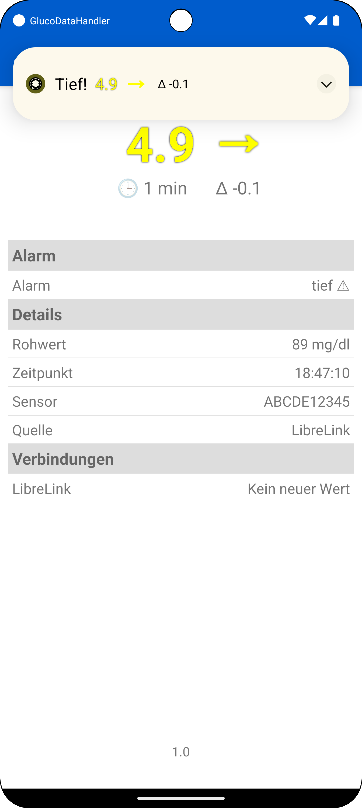
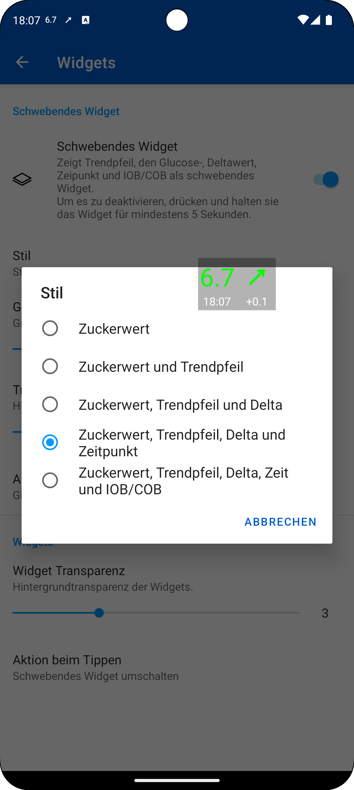

[ English version](README.md)  
[ Wersja polska](README_PL.md)

# GlucoDataHandler (GDH)

Deine zentrale Drehscheibe für Glukosewerte auf deinen Android-Geräten!

Behalte deine Glukosewerte immer im Blick mit GlucoDataHandler (GDH)! Diese innovative App empfängt Daten von zahlreichen Quellen und visualisiert sie übersichtlich auf deinem Android-Smartphone, deiner Smartwatch (Wear OS, Miband und Amazfit) sowie in deinem Auto (via GlucoDataAuto).

## Features

* **Vielfältige Datenquellen:**
    * **Cloud-Dienste:**
        * Empfängt Glukose Werte als **[LibreLink Follower](./SOURCES_DE.md#librelink)**
        * Empfängt Glukose Werte als **[Dexcom Share Follower](./SOURCES_DE.md#dexcom-share)**
        * Empfängt Glukose, IOB und COB Werte von **Nightscout** (Pebble Schnittstelle)
    * **Lokale Apps:**
        * Empfängt Glukose, IOB und COB Werte von **[AndroidAPS](./SOURCES_DE.md#androidaps)**
        * Empfängt Glukose Werte von **[Juggluco](./SOURCES_DE.md#juggluco)**
        * Empfängt Glukose Werte von **[xDrip+](./SOURCES_DE.md#xdrip)**
        * Empfängt Glukose Werte von **[Eversense](./SOURCES_DE.md#eversense)** (mittels **[ESEL](https://github.com/BernhardRo/Esel)**)
        * Empfängt Glukose Werte von **[Dexcom BYODA](./SOURCES_DE.md#dexcom-byoda)** (bisher nicht getestet!)
    * **Benachrichtigungen (Beta!):** Empfängt Werte von Cam APS FX, Dexcom G6/G7, Eversense und potenziell vielen weiteren Apps (kontaktiere mich einfach!).

* **Umfassende Visualisierung:**
    * Stellt mehrere **[Widgets](#widgets)** für Android zur Verfügung.
    * Optionale **[Benachrichtigungen](#benachrichtigungen)**, um weitere Statusbar-Icons zur Verfügung zu haben.
    * Optionale Anzeige als Hintergrundbild auf dem Sperrbildschirm.
    * Unterstützung für Always On Display (AOD).

* **Individuelle Alarme:**
    * Unterstützung von **[Alarmen](#alarme)**:
        * Alarmtypen: sehr tiefe, tiefe, hohe, sehr hohe und veraltete Werte.
        * Individuelle Ton und Vibrationseinstellungen für jeden Alarmtyp.
        * Vollbildbenachrichtigung auf dem Sperrbildschirm.

* **Wear OS Integration:**
    * Stellt mehrere **[Complications](#complications)** für Wear OS zur Verfügung.
    * Erhalte Alarme direkt auf deiner Uhr.
    * **WICHTIGER HINWEIS:** GDH ist keine Standalone-Wear OS App. Für die Einrichtung ist die Telefon-App erforderlich.

* **WatchDrip+ Unterstützung:** Nutze GDH mit bestimmten Miband- und Amazfit-Geräten.

* **Barrierefreiheit:** Volle TalkBack-Unterstützung (Dank an Alex für die Tests!).

* **Android Auto:** Unterstützt **[Android Auto](https://github.com/pachi81/GlucoDataAuto/blob/main/README_DE.md)** über die [GlucoDataAuto App](https://github.com/pachi81/GlucoDataAuto/releases).

* **Tasker Integration:** **[Tasker Ereignisse](#tasker)** Integration.

* **Datenweiterleitung:** Sendet Glucodata Broadcasts an andere Apps (die dies unterstützen).

## Download
 

Die neuste Version kann [hier](https://github.com/pachi81/GlucoDataHandler/releases) heruntergeladen werden.

## Installation

-> [Installationsanleitung](./INSTALLATION_DE.md)

## Quellen

-> [Konfiguration der Quellen](./SOURCES_DE.md)

## Einstellungen

### Smartwatch

* Vibrieren: die Uhr vibriert, wenn der Zielbereich verlassen wird in regelmäßigen Intervallen
* Farbiges AOD: Manche Watchfaces zeigen im Ambient-Mode (AOD) auch farbige Complications (Bilder) an, aber nur, wenn kein monochromes Bild vorhanden ist 
-> dies kann man mit dieser Einstellung erzwingen, dann wird kein monochromes Bild für den Ambient Mode zur Verfügung gestellt. Wenn dann im Ambient-Mode nichts zu sehen ist, muss man die Einstellung rückgängig machen
* Großer Trendpfeil: auf manchen Uhren, wie die Samsung Galaxy Watch 5 Pro mit Wear OS 3, wird der farbige Trendpfeil zu groß erzeugt. Damit man einen normalen Trendpfeil sieht, muss man auf diesen Uhren diese Einstellung deaktivieren
* Vordergrund: um zu verhindern, dass Wear OS die App beendet, empfehle ich diese Einstellung zu aktivieren
* Relative Zeit: zeigt die Zeit in Minuten seit dem der letzte Wert empfangen wurde, anstatt eines festen Zeitstempels. Je nach Uhr kann es sein, dass das nicht korrekt funktioniert aufgrund der jeweiligen Android Batterie Optimierungen auf die ich keinen Einfluss habe
* alle anderen Einstellungen werden über die Smartphone App vorgenommen

### Smartphone

Die einzelnen Einstellungen sind in der App entsprechend beschrieben. Sobald die Smartwatch verbunden ist, werden die Einstellungen übermittelt.

## Alarme

Individuelle Alarmkonfiguration für die verschiedenen Typen, welche als Benachrichtigung oder als Vollbild auf dem Sperrbildschirm angezeigt werden:

  

## Widgets
Es gibt verschiedene Arten von Widgets und ein konfigurierbares schwebendes Widget:

  

## Benachrichtigungen
Es gibt 2 Benachrichtigungen um zusätzliche Icons in der Statusbar zur Verfügung zu haben.
Die erste Benachrichtig is außerdem eine Vordergrundbenachrichtigung, die verhindert, dass Android die App im Hintergrund beenden kann.
Die zweite Benachrichtigung ist immer leer und wird nur für ein weiteres Statusbar Icon verwendet.

<figure>
   
  <figcaption>Statusbar mit Trendpfeil und Deltawert neben dem Glucose Wert von Juggluco.</figcaption>
</figure>

## Complications
Die Wear OS version stellt mehrere Complications zur Verfügung:
* Glukose Werte:

 

* Glukose Wert als Hintergrund (wenn vom Watchface unterstützt und anscheinend nur unter Wear OS 3 verfügbar):

 

* Delta Werte (pro Minute, bzw. pro 5 Minuten, wenn entsprechend aktiviert):

* Trend als Wert und Pfeil (der Pfeil rotiert dynamisch zwischen +2.0 (↑) und -2.0 (↓) und zeigt Doppelpfeile ab +3.0 (⇈) und ab -3.0 (⇊))

* Akku der Smartwatch und des Smartphones (wenn dieses verbunden ist)

**WICHTIG:** Nicht alle Watchfaces zeigen die Complications gleich an, darauf habe ich keinen Einfluss, außer man verwendet die Bilder (farbigen Complications).

## Tasker

-> [Tasker Integration](./TASKER.md)

# Danksagung
@[lostboy86](https://github.com/lostboy86) fürs Testen, Motivieren und dein Feeback

@[froter82](https://github.com/froster82) für die polnische Übersetzung, fürs Testen und dein Feeback

@[nevergiveup](https://github.com/nevergiveup) fürs Testen, Motivieren und dein Feeback

# Unterstützt meine Arbeit
[🍺 Buy me a beer](https://www.buymeacoffee.com/pachi81)

[Paypal me](https://paypal.me/pachi81)
