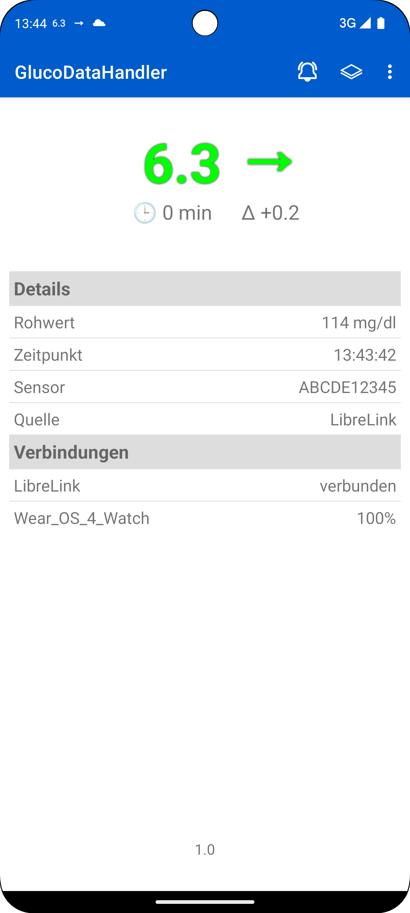
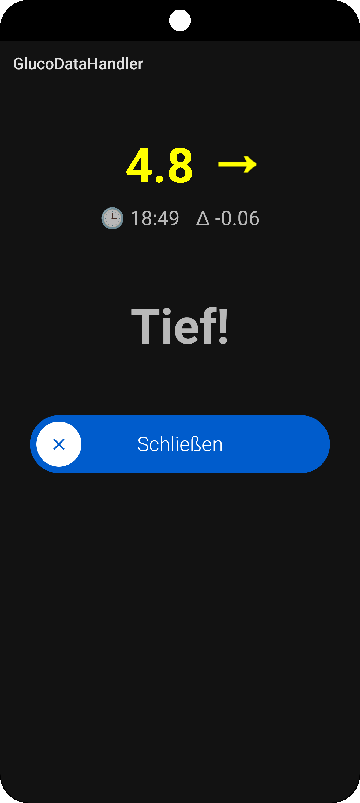
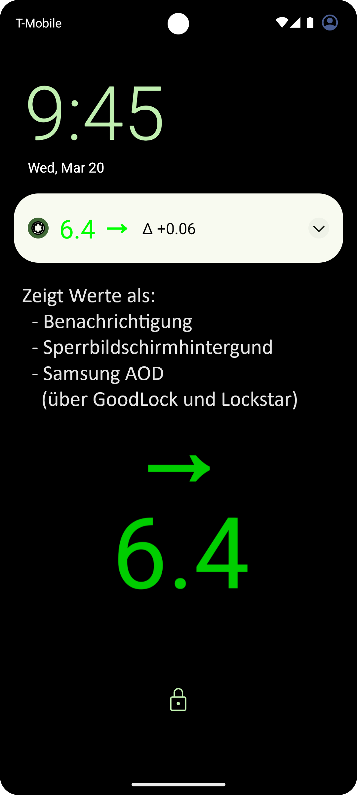
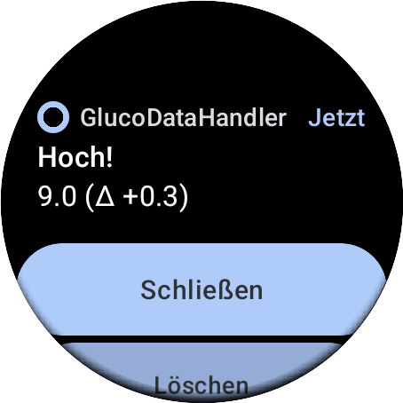
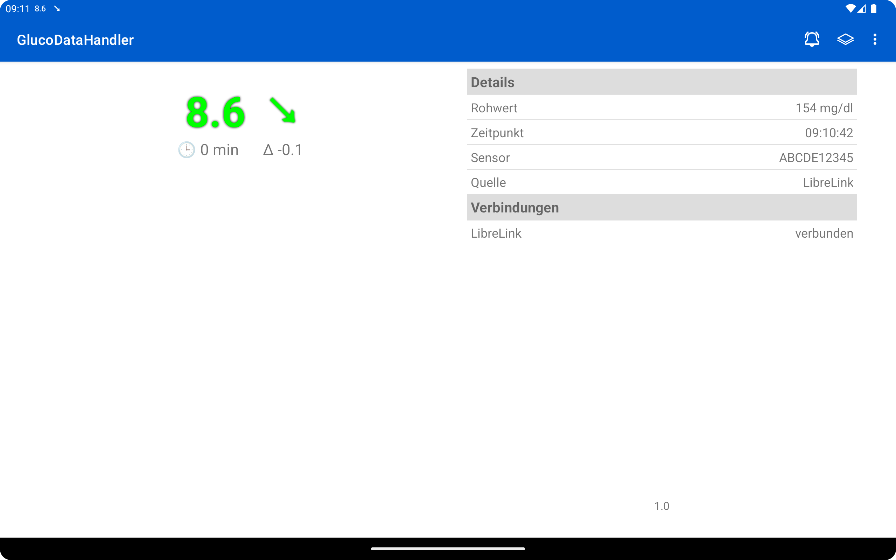

[ English version](README.md)  
[ Wersja polska](README_PL.md)

# GlucoDataHandler (GDH)

Diese innovative App empfängt Daten von zahlreichen Quellen und visualisiert sie übersichtlich auf deinem Android-Smartphone, deiner Smartwatch (Wear OS, Miband und Amazfit) sowie in deinem Auto (via [GlucoDataAuto](https://github.com/pachi81/GlucoDataAuto/blob/main/README_DE.md)).

## Features

* **Vielfältige [Datenquellen](./SOURCES_DE.md):**
    * **Cloud-Dienste:**
        * Empfängt Glukose Werte als **[LibreLinkUp Follower](./SOURCES_DE.md#librelinkup)**
        * Empfängt Glukose Werte als **[Dexcom Share Follower](./SOURCES_DE.md#dexcom-share)**
        * Empfängt Glukose, IOB und COB Werte von **Nightscout** (Pebble Schnittstelle)
    * **Lokale Apps:**
        * Empfängt Glukose, IOB und COB Werte von **[AndroidAPS](./SOURCES_DE.md#androidaps)**
        * Empfängt Glukose Werte von **[Juggluco](./SOURCES_DE.md#juggluco)**
        * Empfängt Glukose Werte von **[xDrip+](./SOURCES_DE.md#xdrip)**
        * Empfängt Glukose Werte von **[Eversense](./SOURCES_DE.md#eversense)** (mittels **[ESEL](https://github.com/BernhardRo/Esel)**)
        * Empfängt Glukose Werte von **[Dexcom BYODA](./SOURCES_DE.md#dexcom-byoda)** (bisher nicht getestet!)
    * **Benachrichtigungen (Beta!):** Empfängt Werte von Cam APS FX, Dexcom G6/G7, Eversense und potenziell vielen weiteren Apps (kontaktiere mich einfach!).

* **Umfassende Visualisierung:**
    * Stellt mehrere **Widgets** für Android zur Verfügung.
    * Optionale **Benachrichtigungen**, um weitere Statusbar-Icons zur Verfügung zu haben.
    * Optionale Anzeige als Hintergrundbild auf dem Sperrbildschirm.
    * Unterstützung für Always On Display (AOD).

* **Individuelle Alarme:**
    * Unterstützung von **Alarmen**:
        * Alarmtypen: sehr tiefe, tiefe, hohe, sehr hohe und veraltete Werte.
        * Individuelle Ton und Vibrationseinstellungen für jeden Alarmtyp.
        * Vollbildbenachrichtigung auf dem Sperrbildschirm.

* **Wear OS Integration:**
    * Stellt mehrere **Complications** für Wear OS zur Verfügung.
    * Erhalte Alarme direkt auf deiner Uhr.
    * **WICHTIGER HINWEIS:** GDH ist keine Standalone-Wear OS App. Für die Einrichtung ist die Telefon-App erforderlich.

* **WatchDrip+ Unterstützung:** Nutze GDH mit bestimmten Miband- und Amazfit-Geräten.

* **Barrierefreiheit:** Volle TalkBack-Unterstützung (Dank an Alex für die Tests!).

* **Android Auto:** Unterstützt **Android Auto** über die [GlucoDataAuto App](https://github.com/pachi81/GlucoDataAuto/blob/main/README_DE.md).

* **[Tasker Integration](./TASKER.md)**

* **Datenweiterleitung:** Sendet Glucodata Broadcasts an andere Apps (die dies unterstützen).

## Download
 
 

Die neuste Version kann auch manuell heruntergeladen und installiert werden. [Hier](./INSTALLATION_DE.md) gibt es mehr Informationen.

## Screenshots

### Phone
      

### Watch
       

### Tablet

## Ziffernblätter

GlucoDataHandler bietet lediglich Wear OS Complications zur Verwendung in anderen Zifferblättern an.

Es gibt jedoch zwei Benutzer, die speziell Zifferblätter für die Complications von GlucoDataHandler erstellen:

- [Ziffernblätter](https://sites.google.com/view/diabeticmaskedman) bereitgestellt von @[sderaps](https://github.com/sderaps)
- [Ziffernblätter](https://play.google.com/store/apps/dev?id=7197840107055554214) bereitgestellt von Graham

# Mitwirkende Entwickler
@[RobertoW-UK](https://github.com/RobertoW-UK): AOD, Batterie-Widget

@[rgodha24](https://github.com/rgodha24): Benachrichtigungsleser

# Danksagung
@[lostboy86](https://github.com/lostboy86) fürs Testen, Motivieren und dein Feeback

@[froter82](https://github.com/froster82) für die polnische Übersetzung, fürs Testen und dein Feeback

@[nevergiveup](https://github.com/nevergiveup) fürs Testen, Motivieren und dein Feeback

# Unterstützt meine Arbeit
 (bevorzugt als Freund - ohne Gebühren)

[🍺 Buy me a beer](https://www.buymeacoffee.com/pachi81) (hohe Gebühren)
