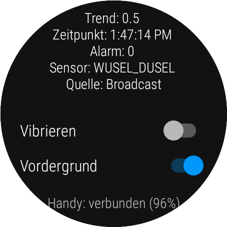
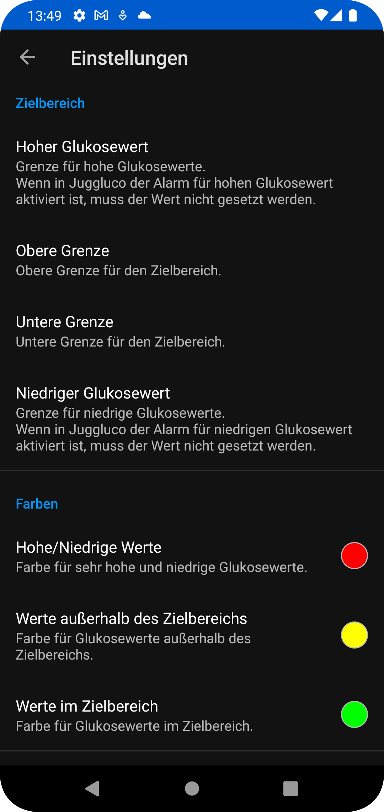

[English version](README.md)

# Glucose Data Handler
## Features

* empfängt Glukose Werte von Juggluco
* empfängt Glukose Werte von xDrip+
* stellt mehrere ****[Complications](#complications)**** für Wear OS zur Verfügung
* unterstützt **[Android Auto](#android-auto)**
* unterstützt **[Tasker Ereignisse](#tasker)** für neue Glukose Werte
* sendet Glucodata Broadcasts an andere Apps (die dies unterstützen)

## Download
Die neuste Version kann [hier](https://github.com/pachi81/GlucoDataHandler/releases) heruntergeladen werden.

## Installation

-> [Installationsanleitung](./INSTALLATION_DE.md)

## Einstellungen

### Smartwatch

* Vibrieren: die Uhr vibriert, wenn der Zielbereich verlassen wird in regelmäßigen Intervallen
* Vordergrund: um zu verhindern, dass Wear OS die App beendet, empfehle ich diese Einstellung zu aktivieren
* alle anderen Einstellungen werden über die Smartphone App vorgenommen

### Smartphone

Die einzelnen Einstellungen sind in der App entsprechend beschrieben. Sobald die Smartwatch verbunden ist, werden die Einstellungen übermittelt.

#### Complications
Die Wear OS version stellt mehrere Complications zur Verfügung:
* Glukose Werte:

* Glukose Wert als Hintergrund (wenn vom Watchface unterstützt und anscheinend nur unter Wear OS 3 verfügbar):

* Delta Werte (pro Minute, bzw. pro 5 Minuten, wenn entsprechend aktiviert):

* Trend als Wert und Pfeil (der Pfeil rotiert dynamisch zwischen +2.0 (↑) und -2.0 (↓) und zeigt Doppelpfeile ab +3.0 (⇈) und ab -3.0 (⇊))

* Akku der Smartwatch und des Smartphones (wenn dieses verbunden ist)

**WICHTIG:** Nicht alle Watchfaces zeigen die Complications gleich an, darauf habe ich keinen Einfluss, außer man verwendet die Bilder (farbigen Complications).

### Android Auto

Die App unterstützt Android Auto auf zweit Arten:

#### Option #1: Dummy Media Player
Wenn sie nicht über Android Auto Musik hören, können sie Media Player Unterstützung verwenden:

WICHTIG: da die App selber keine Musik abspielt, sollte man alle anderen Media Player aus dem Launcher entfernen, damit diese App entsprechend angezeigt wird.

#### Option #2: Benachrichtigungen verwenden

Alternativ zum Media Player kann die Android Auto Benachrichtigung verwendet werden:

INFO: das Benachrichtigungs Popup erscheint bei jedem neuen Wert.

### Tasker

-> [Tasker support](./TASKER.md)

