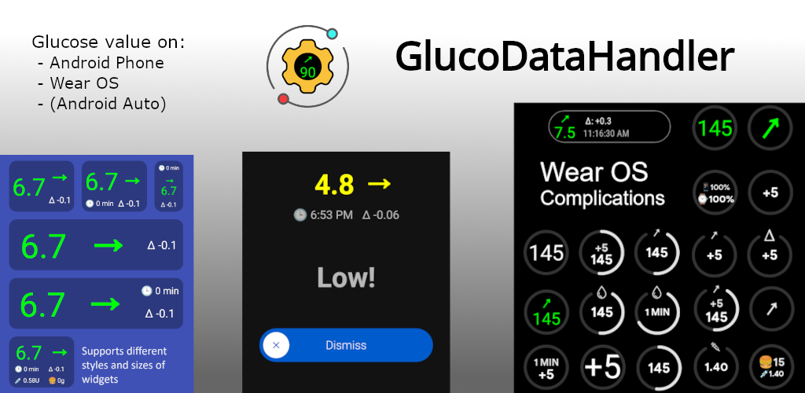
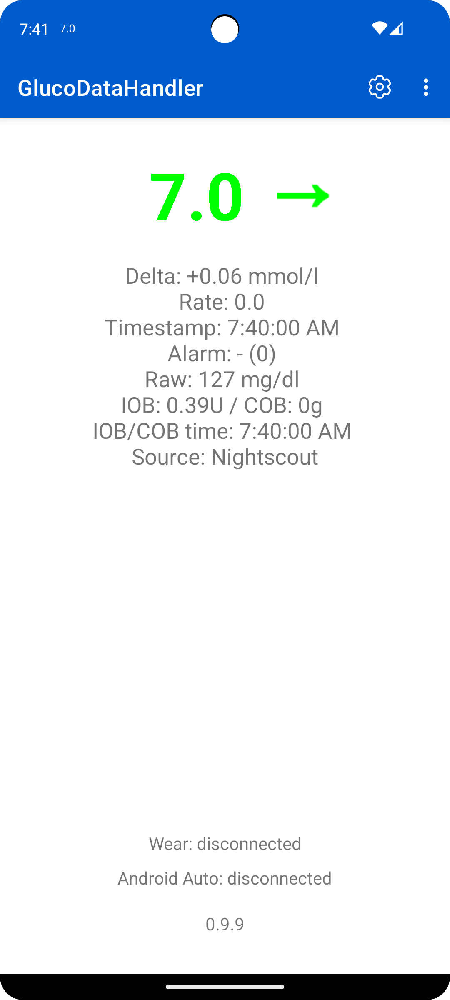
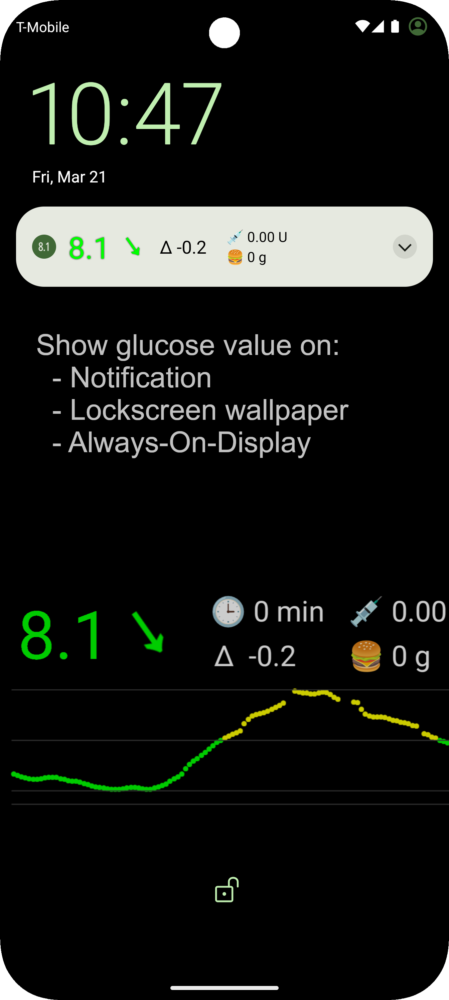
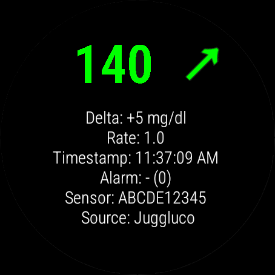
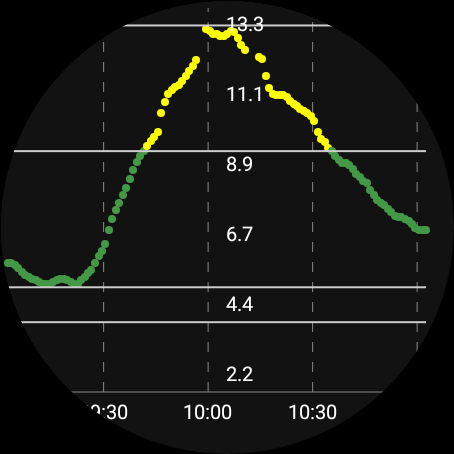
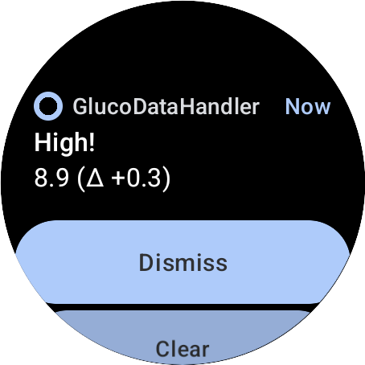
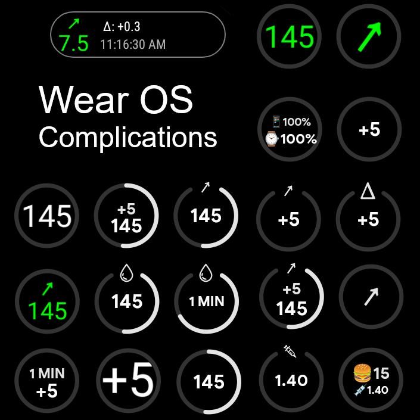
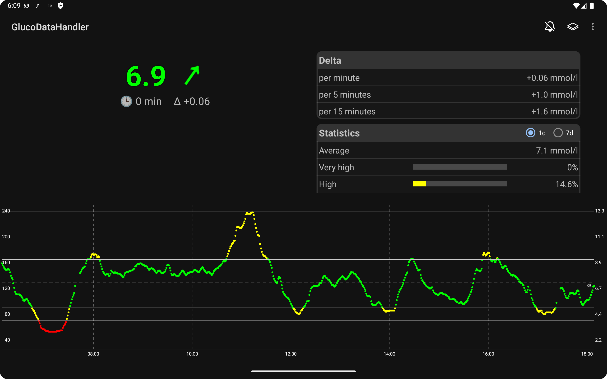

[ English version](README.md)  
[ Deutsche Version](README_DE.md)

# GlucoDataHandler (GDH)

Ta innowacyjna aplikacja odbiera dane z różnych źródeł i wizualizuje je w przejrzysty sposób na smartfonie z Androidem, smartwatchu (Wear OS, Miband i Amazfit) oraz w samochodzie (za pośrednictwem [GlucoDataAuto](https://github.com/pachi81/GlucoDataAuto/blob/main/README_PL.md)).

## Funkcje

* **Różne [źródła](./SOURCES_PL.md) danych:**
  
  * **Usługi chmurowe:**
    * Odbiera wartości glukozy jako **[LibreLink follower](./SOURCES_PL.md#librelink)**
    * Odbiera wartości glukozy jako **[Dexcom Share follower](./SOURCES_PL.md#dexcom-share)**
    * Odbiera wartości glukozy, IOB i COB z **Nightscout** (interfejs pebble).
  * **Aplikacje lokalne:**
    * Odbiera wartości glukozy, IOB i COB z **[AndroidAPS](./SOURCES_PL.md#androidaps)**.
    * Odbiera wartości glukozy z **[Juggluco](./SOURCES_PL.md#juggluco)**
    * Odbiera wartości glukozy z **[xDrip+](./SOURCES_PL.md#xdrip)**
    * Odbiera wartości glukozy z **[Eversense](./SOURCES_PL.md#eversense)** (przy użyciu **[ESEL](https://github.com/BernhardRo/Esel)**).
    * Odbiera wartości glukozy z **[Dexcom BYODA](./SOURCES_PL.md#dexcom-byoda)** (funkcja jeszcze nie została przetestowana!)
  * **Powiadomienia (Beta!):** Odbiera wartości z aplikacji Cam APS FX, Dexcom G6/G7, Eversense i potencjalnie wielu innych.

* **Kompleksowa wizualizacja:**
  
  * Udostępnia kilka **widgetów** i pływający widget na telefonie.
  * Udostępnia opcjonalne **powiadomienia** z różnymi ikonami na telefonie.
  * Opcjonalnie może wyświetlać dane w formie tapety ekranu blokady.
  * Obsługuje funkcję wyświetlania danych na ekranie Always On Display (AOD).

* **Alarmy, które można samodzielnie ustawiać:**
  
  * Obsługa **alarmów**:
    * Alarm dla bardzo niskich, niskich, wysokich, bardzo wysokich i nieaktualnych wartości glukozy.
    * Indywidualne ustawienia dźwięku dla każdego typu alarmu.
    * Alarm pełnoekranowy na ekranie blokady.

* **Integracja z Wear OS:**
  
  * Zapewnia kilka **komplikacji** dla Wear OS.
  * Uruchamia alarmy bezpośrednio na zegarku.
  * **WAŻNA UWAGA:** GDH na Wear OS nie może działać samodzielnie. Do konfiguracji wymagana jest aplikacja na telefonie.

* **Obsługa WatchDrip+:** Używaj GDH z określonymi urządzeniami Miband i Amazfit.

* **Ułatwienia dostępu:** Pełna obsługa funkcji TalkBack (podziękowania dla Alexa za testy!).

* **Android Auto:** Obsługa **Android Auto** przy użyciu aplikacji [GlucoDataAuto app](https://github.com/pachi81/GlucoDataAuto/blob/main/README_PL.md)

* **Integracja z aplikacją Tasker:** Integracja z aplikacją **[Tasker](./TASKER.md)**

* **Przesyłanie danych do innych aplikacji:** Wysyła transmisje danych o glukozie do innych aplikacji (które obsługują tę transmisję).

## Pobierz

 

Aplikację można również pobrać i zainstalować ręcznie. [Tutaj](./INSTALLATION_PL.md) można przeczytać więcej informacji.

## Zrzuty ekranu

### Telefon

      

### Zegarek

      

### Tablet

## Tarcze zegarków

GlucoDataHandler udostępnia tylko komplikacje do wykorzystania w innych tarczach zegarka z WearOS.

Dwóch użytkowników tworzy jednak tarcze zegarka specjalnie dla komplikacji GlucoDataHandler:

- [tarcze](https://sites.google.com/view/diabeticmaskedman), które tworzy @[sderaps](https://github.com/sderaps)
- [tarcze](https://play.google.com/store/apps/dev?id=7197840107055554214), które tworzy Graham

# Deweloperzy wnoszący swój wkład

@[RobertoW-UK](https://github.com/RobertoW-UK): AOD, widget baterii

@[rgodha24](https://github.com/rgodha24): Czytnik powiadomień

# Szczególne podziękowania

@[lostboy86](https://github.com/lostboy86) za testy, motywację i informacje zwrotne

@[froter82](https://github.com/froster82) za tłumaczenie na język polski, testy i informacje zwrotne

@[nevergiveup](https://github.com/nevergiveup) za testy, motywację i informacje zwrotne

# Wesprzyj moją pracę

[🍺 Postaw mi piwo](https://www.buymeacoffee.com/pachi81)
