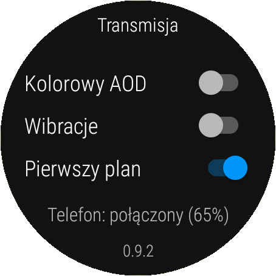
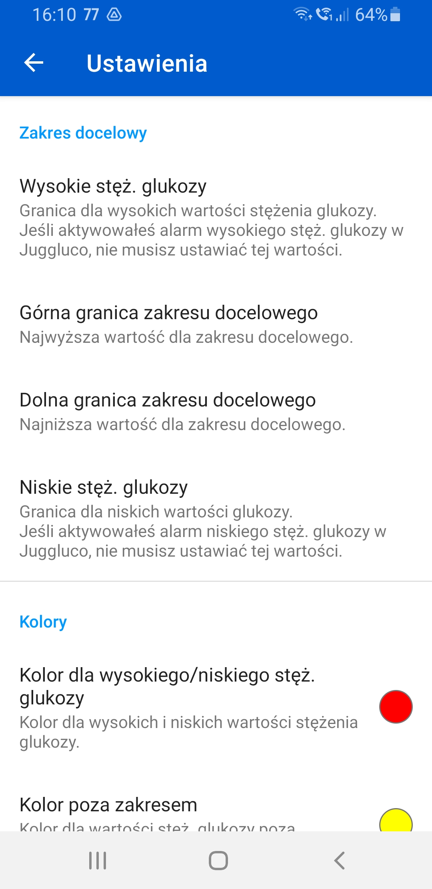
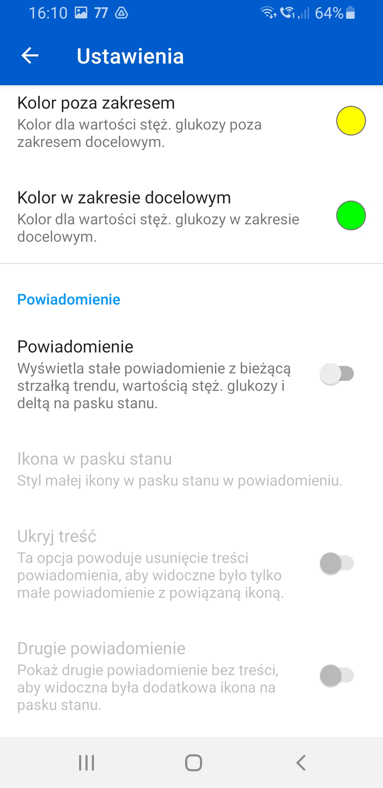
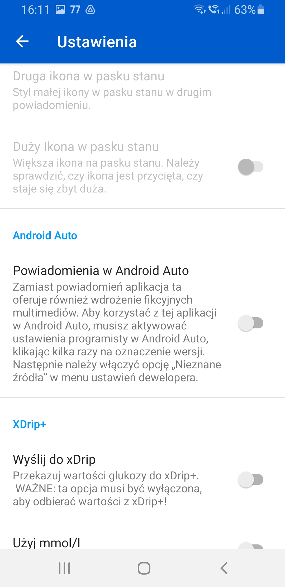
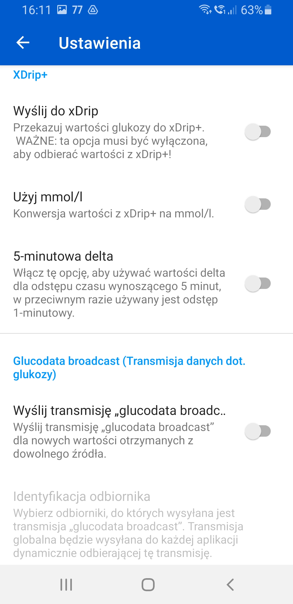

[ English version](README.md)  
[ Deutsche Version](README_DE.md)

# Glucose Data Handler
## Funkcje

* odbiera wartości glukozy z Juggluco
* odbiera wartości glukozy z xDrip+
* udostępnia kilka **[widgetów](#Widgety)** i pływający widget dla telefonu
* udostępnia opcjonalne **[powiadomienia](#Powiadomienia)** z różnymi ikonami dla telefonu
* udostępnia kilka **[komplikacj](#Komplikacje)** dla Wear OS
* umożliwia połączenie z **[Android Auto](#android-auto)**
* Integracja z aplikacją **[Tasker](#Aplikacja Tasker)**
* wysyła transmisje danych o glukozie do innych aplikacji (które obsługują tę transmisję)

## Pobierz
Aktualną wersję można pobrać [tutaj](https://github.com/pachi81/GlucoDataHandler/releases).

## Instalacja

-> [Instrukcja instalacji](./INSTALLATION_PL.md)

## Ustawienia

## Zegarek

* Wibracja: zegarek wibruje, jeśli zakres docelowy został przekroczony i powtarza wibracje tak długo, jak długo glukoza pozostaje poza zakresem docelowym
* Kolorowy AOD: niektóre tarcze zegarków obsługują tylko kolorowe komplikacje dla zawsze włączonego ekranu w trybie AOD, jeśli nie ma monochromatycznego, musisz aktywować tę funkcję
* Duża strzałka trendu: w przypadku zegarków takich jak Samsung Galaxy Watch 5 Pro strzałka trendu jest zbyt duża, więc można wyłączyć to ustawienie, aby uzyskać strzałkę trendu w normalnym rozmiarze
* Pierwszy plan: opcja zalecana, aby zapobiec zamykaniu tej aplikacji przez Wear OS (spróbuj również dezaktywować Play Protect, ponieważ funkcja ta zamyka aplikacje spoza Sklepu Play)
* inne ustawienia: wszystkie inne ustawienia wprowadza się w aplikacji na telefonie

### Telefon

Ustawienia dla aplikacji na telefon opisane są w samej aplikacji. Ustawienia z telefonu zostaną przesłane do zegarka, jeśli jest on podłączony.

   

## Widgety
Dostępnych jest kilka rodzajów widgetów na telefon:

Dostępny jest również pływający widget, który może być obsługiwany przez aplikację Tasker.

## Powiadomienia
Dostępne są dwa powiadomienia, które można aktywować. Dla każdego powiadomienia można wybrać ikonę, która pojawi się na pasku stanu telefonu.
Pierwsze powiadomienie jest również używane jako powiadomienie na pierwszym planie, aby zapobiec zamknięciu tej aplikacji przez system Android w tle. 
Jeśli więc masz jakiekolwiek problemy z tą aplikacją, zalecam, aby aktywować przynajmniej pierwsze powiadomienie.
Drugie powiadomienie to puste powiadomienie, które można aktywować, aby uzyskać dodatkową ikonę na pasku stanu.
<figure>
   
  <figcaption>Pasek stanu pokazuje użycie strzałki trendu i ikon wartości delta obok ikony wartości glukozy z Juggluco.</figcaption>
</figure>

## Komplikacje
Istnieje kilka komplikacji dla różnych typów komplikacji w ramach Wear OS, które mogą wyświetlać:
* Wartość glukozy (używana również do koła zakresu)

 

* Wartość glukozy jako obraz tła (jeśli funkcja ta jest obsługiwana przez tarczę zegarka i zdaje się, że jest dostępna tylko w Wear OS 3)

 

* Wartość delty (na minutę lub na 5 minut)

* Tempo (trend) jako wartość i strzałka (strzałka obraca się dynamicznie między +2,0 (↑) a -2,0(↓) i pokazuje podwójne strzałki od +3,0 (⇈) i od -3,0 (⇊))

* Poziom baterii w zegarku i w telefonie (jeśli jest podłączony)

**WAŻNA UWAGA:** Nie wszystkie komplikacje są w pełni obsługiwane przez każdą tarczę zegarka. Na przykład typ SHORT_TEXT obsługuje ikonę, tekst i tytuł, ale większość tarcz zegarków pokazuje tylko ikonę i tekst lub tekst i tytuł, ale są też takie, które pokazują wszystkie 3 typy w jednym.
Również komplikacja WARTOŚĆ_ZAKRESU jest obsługiwana inaczej na każdej tarczy zegarka.

## Android Auto

Ta aplikacja obsługuje Android Auto.

### Opcja nr 1: Korzystanie z fikcyjnego odtwarzacza multimediów
Jeśli nie używasz żadnego odtwarzacza multimedialnego w Android Auto do słuchania muzyki, możesz użyć aplikacji GlucoDataHandler, aby wyświetlić jego wartości w wiadomościach dotyczących multimediów:

WAŻNE: aby to działało, zaleca się wyłączenie wszystkich innych aplikacji multimedialnych w programie uruchamiającym Android Auto.

### Opcja nr 2: Użycie powiadomień

Można również korzystać z powiadomień:

 

### Opcja nr 3: Korzystanie z aplikacji

## Aplikacja Tasker

-> [Obsługa aplikacji Tasker](./TASKER.md)
