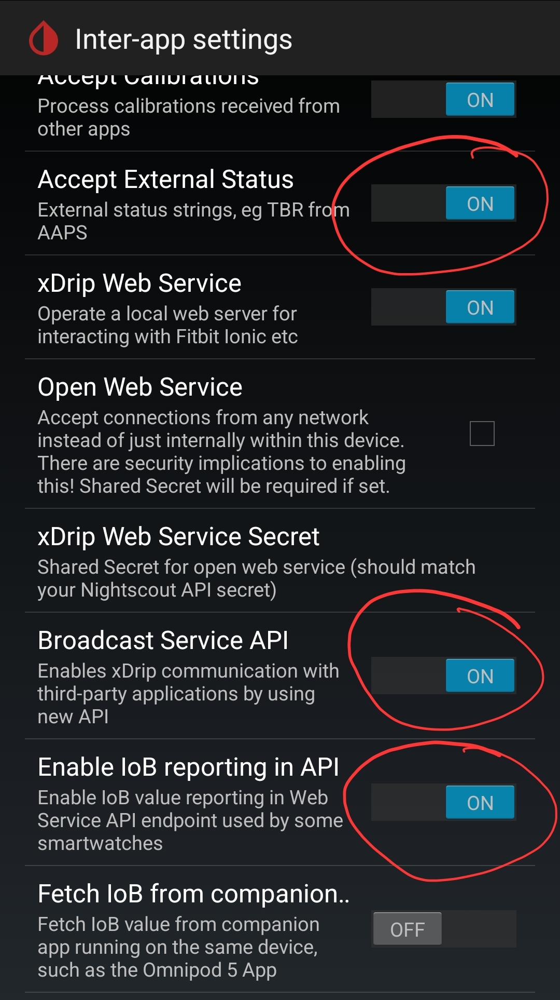
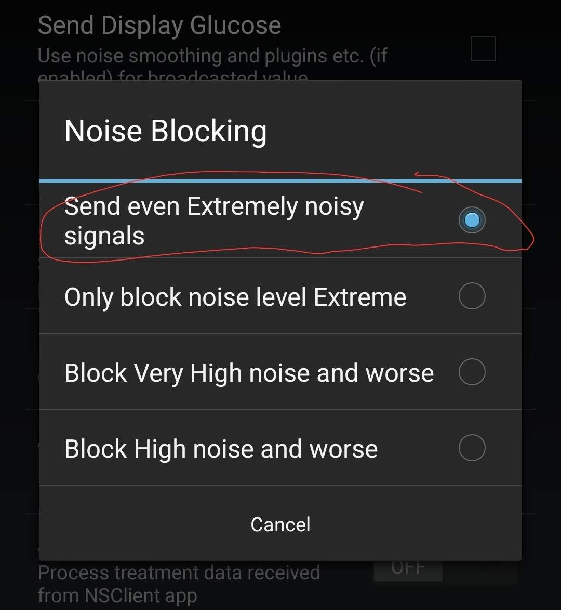
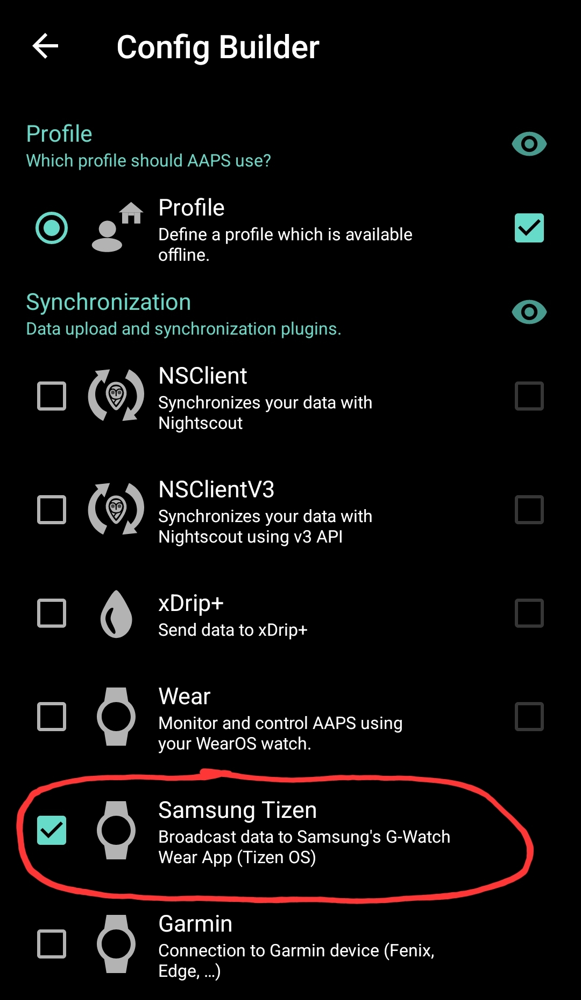

[ Deutsche Version](SOURCES_DE.md)  
[ Wersja polska](SOURCES_PL.md)

# LibreLink

To set up LibreLink as follower, you need the account data from LibreLinkUp.
If you have not set up your LibreLinkUp account yet, follow this [instruction](https://librelinkup.com/articles/getting-started).

Here is a quick summary of the steps to do:
* open your FreeStyle Libre App and select in the menu `Share` or `Connected Apps`
* activate LibreLinkUp connection
* install LibreLinkUp from [PlayStore](https://play.google.com/store/apps/details?id=org.nativescript.LibreLinkUp)
* setup your accout and wait for the invitation
* after accept the invitation you do not need the LibreLinkUp App "anymore"
* now you can add your LibreLinkUp account to GlucoDataHandler and activate this source
    
# Dexcom Share

To receive data from Dexcom Share servers, you need to have:
- sharing enabled on the Dexcom application that is connected to the sensor
- accepted the invitation on the Dexcom Follower app (you can uninstall it afterwards)

**Important**: it does not work with a follower user!

# Juggluco
If you are using Juggluco to receive glucose values, open Juggluco and enable `Glucodata broadcast` and select `de.michelinside.glucodatahandler` (or `de.michelinside.glucodataauto` for [GlucoDataAuto](https://github.com/pachi81/GlucoDataAuto/blob/main/README.md)) in Settings. Save and Ok.

# xDrip+
If you are using xDrip+ to receive glucose values, open xDrip+, go to setting and select Inter-app settings

* Enable "Broadcast Service API"

## Alternative: Broadcast locally
Go to setting and select Inter-app settings
* Enable "Broadcast locally"
* Enable "Compatible Broadcast"
* Check "Identify receiver" to be empty or if an entry already exists, then add `de.michelinside.glucodatahandler` (or `de.michelinside.glucodataauto` for [GlucoDataAuto](https://github.com/pachi81/GlucoDataAuto/blob/main/README.md)) separated by a space
* set \"Noise Blocking\" to \"Send even Extremely noisy signals\"
  
 

# AndroidAPS
To receive values from AAPS:
* open AAPS app
* go to "Config Builder"
* enable "Samsung Tizen" or "Data Broadcaster"

# Eversense
To receive values from Eversense, you have to use [ESEL](https://github.com/BernhardRo/Esel) either in companion mode (reading notification) or connected to the patched Eversense app.

# Dexcom BYODA
To receive values from Dexcom BYODA you have to enable broadcast to xDrip+, AAPS or both while building the app.
