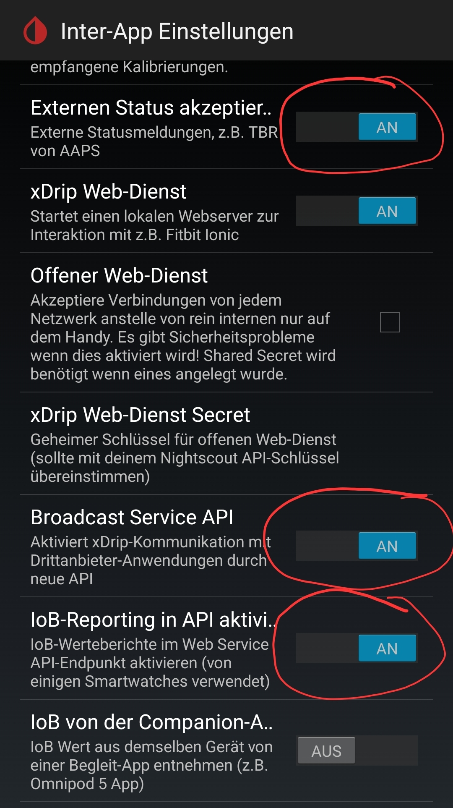
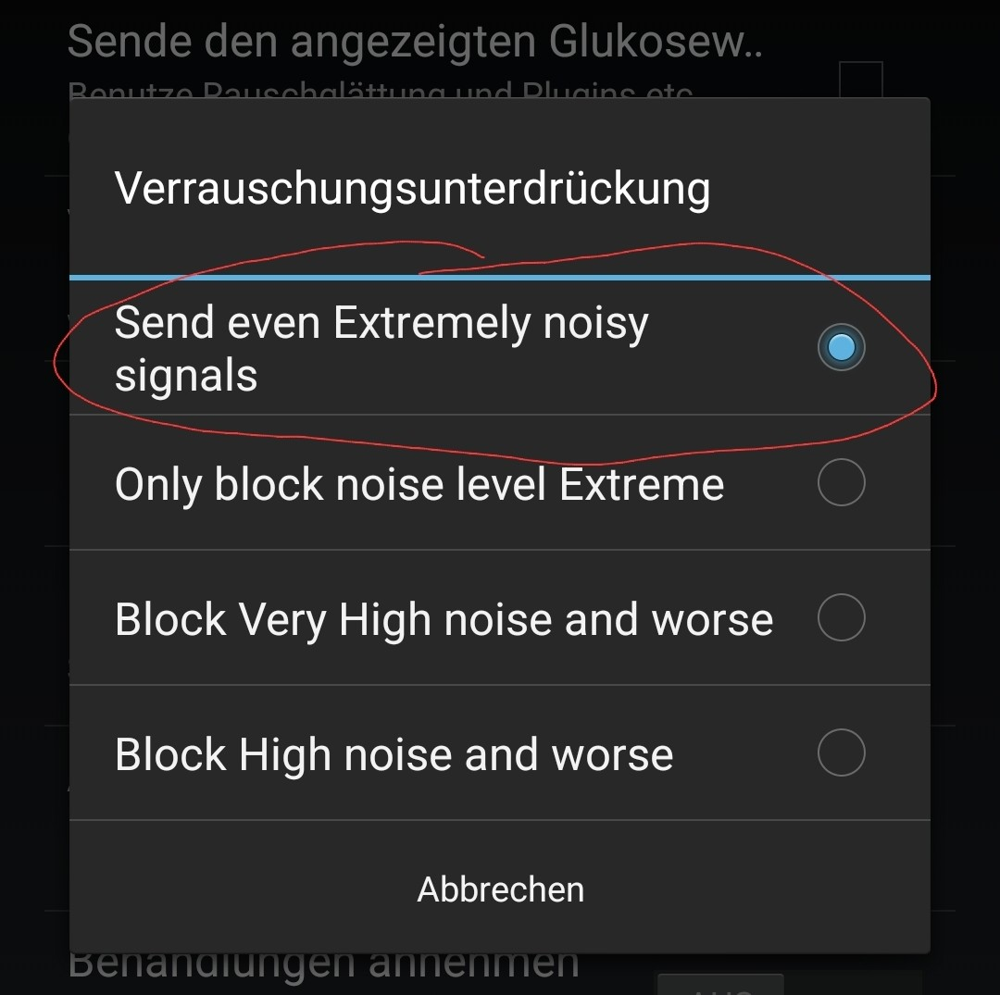

[ English version](SOURCES.md)  
[ Wersja polska](SOURCES_PL.md)

# Quellen <!-- omit in toc -->
- [LibreLink](#librelink)
- [Dexcom Share](#dexcom-share)
- [Juggluco](#juggluco)
- [xDrip+](#xdrip)
- [AndroidAPS](#androidaps)
- [Eversense](#eversense)
- [Dexcom BYODA](#dexcom-byoda)

# LibreLink
Um LibreLink zu verwenden wird ein LibreLinkUp Konto benötigt.
Wenn noch keines erstellt wurde, folgen Sie bitte dieser [Anleitung](https://librelinkup.com/articles/getting-started).

Eine kleiner Zusammenfassung der Schritte, welche zu erledigen sind:
* FreeStyle Libre App öffnen und unter `Verbinden` auf `Teilen` oder `Verbundene Anwendungen` klicken
* hier muss der LibreLinkUp eingerichtet werden
* danach die LibreLinkUp App aus dem [PlayStore](https://play.google.com/store/apps/details?id=org.nativescript.LibreLinkUp) installieren
* in der LibreLinkUp App einloggen und die Einladung annehmen
* danach wird die LibreLinkUp App nicht mehr zwingend benötigt und kann wieder deinstalliert werden
* jetzt können die LibreLinkUp Kontodaten in GlucoDataHandler hinterlegt und die Quelle aktiviert werden
    
# Dexcom Share
Um Daten von Dexcom Share zu empfangen, müssen folgende Schritte erfüllt sein:
- in der Dexcom App, welche mit dem Sensor verbunden ist, Teilen aktivieren
- einmalig die Einladung in der Dexcom Follower App annehmen (die App kann danach wieder deinstalliert werden)

Wichtig: es funktioniert nicht mit einem Follower Benutzer!

# Juggluco
Für die Benuzer von Juggluco, nach der Installation des GlucoDataHandler in den Juggluco Einstellungen den Punkt `Glucodata broadcast` aktivieren und `de.michelinside.glucodatahandler` (oder `de.michelinside.glucodataauto` für [GlucoDataAuto](https://github.com/pachi81/GlucoDataAuto/blob/main/README_DE.md)) auswählen.
Anschließend speichern und mit OK beenden.

# xDrip+
Für die Benutzer von xDrip+, in den Einstellung den Eintrag Inter-App Einstellungen öffnen und wie folgt konfigurieren:

* Enable "Broadcast Service API"

## Alternative: Lokaler Broadcast <!-- omit in toc -->
In den Einstellung den Eintrag Inter-App Einstellungen öffnen und wie folgt konfigurieren:
* "Lokaler Broadcast" aktivieren
* "Kompatible Broadcast" aktivieren
* prüfen, ob "Identifiziere Empfänger" leer ist; ist bereits ein Eintrag vorhanden, dann durch ein Leerzeichen getrennt `de.michelinside.glucodatahandler` (oder `de.michelinside.glucodataauto` für [GlucoDataAuto](https://github.com/pachi81/GlucoDataAuto/blob/main/README_DE.md)) hinzufügen
* in Verrauschungsunterdrückung \"Send even Extremely noisy signals\" auswählen
  
 

# AndroidAPS
Konfiguration von AAPS:
* AAPS App öffnen
* "Konfiguration" öffnen
* "Samsung Tizen" oder "Data Broadcaster" aktivieren

# Eversense
Um Werte von Eversense zu empfangen, benötigt es die App [ESEL](https://github.com/BernhardRo/Esel), welche entweder im Companion Mode (Benachrichtigung lesen) oder in Verbindungen mit der gepatchten Eversense App betrieben werden kann.

# Dexcom BYODA
Um Werte von Dexcom BYODA zu erhalten, muss bei der Erstellung der App, die Übertragung an xDrip+, AAPS oder an beide aktiviert werden.