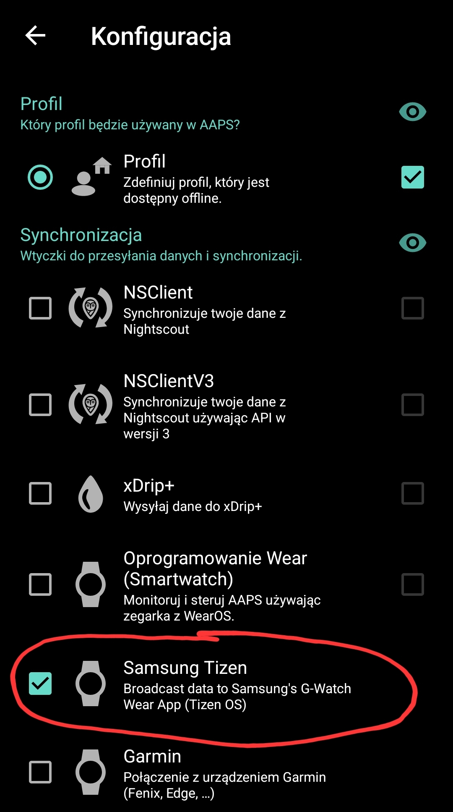

[ English version](SOURCES.md)  
[ Deutsche Version](SOURCES_DE.md)

# LibreLink

Aby skonfigurować LibreLink jako „follower”, potrzebne są dane konta z LibreLinkUp.
Jeśli nie skonfigurowałeś jeszcze swojego konta LibreLinkUp, postępuj zgodnie z tą [instrukcją](https://librelinkup.com/articles/getting-started).

Oto krótkie podsumowanie kroków, które należy wykonać:
* otwórz aplikację FreeStyle Libre i wybierz w menu `Udostępnianie` lub `Podłączone aplikacje`.
* aktywuj połączenie LibreLinkUp
* zainstaluj LibreLinkUp ze [Sklepu Play](https://play.google.com/store/apps/details?id=org.nativescript.LibreLinkUp)
* skonfiguruj swoje konto i czekaj na zaproszenie
* po zaakceptowaniu zaproszenia nie potrzebujesz już aplikacji LibreLinkUp.
* teraz możesz dodać swoje konto LibreLinkUp do GlucoDataHandler i aktywować to źródło.
    
# Dexcom Share
Aby odbierać dane z serwerów Dexcom Share, musisz mieć:
- włączone udostępnianie danych w aplikacji Dexcom, która jest połączona z sensorem
- zaakceptowane zaproszenie w aplikacji Dexcom Follower (możesz ją później odinstalować)

 Ważne: nie działa z użytkownikiem obserwującym!

# Juggluco

Jeśli używasz Juggluco do odbierania wartości glukozy, otwórz Juggluco i włącz w Ustawieniach opcję `Glucodata broadcast` i wybierz `de.michelinside.glucodatahandler` (or `de.michelinside.glucodataauto` for [GlucoDataAuto](https://github.com/pachi81/GlucoDataAuto/blob/main/README_PL.md)). Zapisz i OK.

# xDrip+
Jeśli używasz xDrip+ do odbierania wartości glukozy, otwórz xDrip+, przejdź do ustawień i wybierz Ustawienia innych aplikacji

* włącz "Broadcast Service API"

## Alternatywa: nadawanie lokalne xDrip+
Przejdź do ustawień i wybierz Ustawienia innych aplikacji
* włącz "Nadawaj lokalnie"
* ustaw "Blokowanie szumów" na "Send even Extremely noisy signals"
* włącz "Kompatybilny Broadcast"
* sprawdź, czy pole "Identyfikuj odbiornik" jest puste, a jeśli jest już tam jakiś wpis, dodaj za nim spację a następnie wpisz `de.michelinside.glucodatahandler` (lub `de.michelinside.glucodataauto` for [GlucoDataAuto](https://github.com/pachi81/GlucoDataAuto/blob/main/README_PL.md))

 

# AndroidAPS

Aby odbierać wartości z AAPS:
* otwórz AAPS
* przejdź do "Konfiguracja"
* włącz "Samsung Tizen" lub "Data Broadcaster"

# Eversense
Aby odbierać wartości z Eversense, musisz używać [ESEL](https://github.com/BernhardRo/Esel) w trybie towarzyszącym (czytanie powiadomień) lub połączyć się z poprawioną (patched) aplikacją Eversense.

# Dexcom BYODA
Aby otrzymywać wartości z Dexcom BYODA, należy włączyć transmisję do xDrip+, AAPS lub obu podczas tworzenia aplikacji.